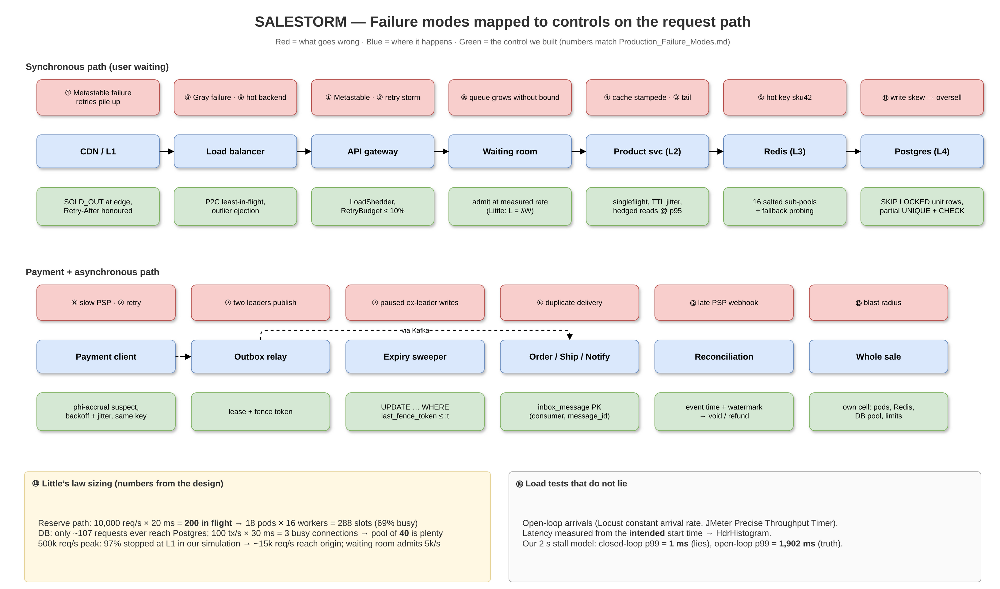

# Production Failure Modes — what breaks real flash sales, and what SALESTORM does about it



*Editable source: [`drawio/resilience_controls.drawio`](drawio/resilience_controls.drawio). Decisions: [ADR-009](../10_ADR/ADR-009-resilience-controls.md), [ADR-010](../10_ADR/ADR-010-cell-isolation-and-open-loop-testing.md).*

Our happy path was already correct: admission tokens, unit rows with `SKIP LOCKED`, authorize-then-capture, outbox, idempotency keys. This page is about the **unhappy path**: the 14 ways a system like ours actually falls over in production, how each one would hit *our* sale (100 units, 10,000 buyers, 10k req/s normal, 500k req/s peak, 30 s Order Service outage), and the exact control, class or table that stops it.

Numbers marked **[sim]** come from a real run of [`resilience_sim.py`](../11_AI_Assisted_Validation/simulation/resilience_sim.py) (seed 42, output in [`resilience_output.txt`](../11_AI_Assisted_Validation/simulation/resilience_output.txt)). Numbers marked **[pg]** come from [`resilience_checks.sql`](../04_Database/tools/resilience_checks.sql) run against PostgreSQL 17. Everything else is a design estimate.

## Summary

| # | Failure mode | How it would hit SALESTORM | Our control | Where it lives | Evidence |
|---|---|---|---|---|---|
| 1 | Metastable failure | A 2 s Redis failover turns into minutes of timeouts as retries keep the queue full | Admission control + load shedding + retry budget | `LoadShedder`, Waiting Room, `RetryBudget` | [sim] naive never recovers; controlled recovers in the first second |
| 2 | Retry storm | 10,000 phones retry "Buy" every 100 ms | Retry only idempotent calls, full-jitter backoff, 10% retry budget, fail fast | `RetryingClient`, `BackoffWithJitter`, `RetryBudget` | [sim] 4.26× vs 1.01× load amplification |
| 3 | Tail latency amplification | One slow product replica makes every page slow | Hedged reads at p95 (reads only), no sync fan-out on the Buy path | `HedgedReadClient` | design |
| 4 | Cache stampede | Stock-status key expires, 2,000 requests hit Postgres at once | Singleflight + TTL jitter | `SingleflightCache` | [sim] 2,000 DB reads → 1 |
| 5 | Hot key | `tokens:sku42` gets every request on one Redis shard | 16 salted sub-pools, fallback probing, local empty hints | `HotKeySaltedTokenPool` | [sim] max 57 ops on one key vs 10,000 |
| 6 | Duplicate delivery | Kafka redelivers `PaymentAuthorized` after the outage | Outbox + **inbox** table at each consumer | `inbox_message`, `InboxDeduplicator` | [sim] 13 duplicates → 0; [pg] |
| 7 | Split-brain leader | Paused sweeper wakes up and releases a unit someone just bought | Lease with monotonic fencing token checked by the DB | `lease`, `last_fence_token`, `LeaseManager` | [sim] + [pg] stale token rejected |
| 8 | Gray failure | PSP endpoint answers health checks but takes 8 s to authorize | Health from real traffic, outlier ejection, phi-accrual | `PhiAccrualDetector`, `OutlierDetector` | design |
| 9 | Unbalanced backends | Round-robin keeps feeding a pod stuck in GC | Power of two choices on in-flight count | `P2CLoadBalancer` (Envoy) | design |
| 10 | Wrong capacity numbers | Pools sized by guess: either starved or thrashing | Little's law sizing, < 70% utilization | Sizing table below | design math |
| 11 | Write skew | Two TXs both read "1 left" and both sell → unit #101 | Unit rows + `SKIP LOCKED` + partial UNIQUE + CHECK | `inventory_unit`, `uq_reservation_one_live_per_unit` | [pg] second live reservation rejected |
| 12 | Event time vs processing time | Late PSP webhook arrives after the reservation expired | Event time + watermark; late events to a reconciliation side output | `WatermarkTracker`, `reconciliation_case` | design |
| 13 | Blast radius | Sale traffic starves normal catalog/checkout | The sale runs in its own cell | Deployment cell | design |
| 14 | Coordinated omission | Load test says p99 = 1 ms while users wait 2 s | Open-loop arrivals, intended-start latency, HdrHistogram | `locustfile.py`, `.jmx` | [sim] p99 1 ms (closed) vs 1,902 ms (open) |

---

## 1. Metastable failure
**The failure.** The system is fine at 80% load. A short trigger (Redis failover, GC pause, deploy) pushes it over. Clients time out and retry, so load goes *up* while capacity is down. When the trigger is gone the extra retry load stays, and the system never comes back on its own.

**How it hits us.** Checkout runs at ~8,000 of 10,000 req/s capacity during the sale window. A 2 s Redis failover drops capacity to ~1,000 req/s. Every timed-out buyer retries; the queue fills with requests whose clients have already given up, so the servers spend their time on dead work.

**Our control.**
- **Admission control at the edge.** The waiting room admits a fixed rate we measured, not "whatever arrives".
- **Load shedding.** `LoadShedder` rejects a request *at the door* (503 + `Retry-After`) when its expected queue wait is longer than the 300 ms client deadline. It never queues work that is going to be wasted. Expired queued work is dropped, not served.
- **Retry budget** (see #2) so retries can't multiply load.

**Implemented by.** `AdmissionController` → `LoadShedder` in the API gateway and checkout pods; Waiting Room service; `RetryBudget` in every client.

**[sim]** Same 60 s run, same 2 s blip (t = 10–12 s), 480,000 fresh requests:

| | Naive retries (fixed 100 ms, 5 tries, no shedding) | Budget + jitter + shedding |
|---|---|---|
| Total attempts | 2,045,760 (4.26× load) | 483,560 (1.01×) |
| Goodput | 16.7% | 97.2% |
| Recovered after blip | **not within the remaining 48 s** | **in the first second** |
| Success rate, last 10 s | 0.0% | 100.0% |
| Peak queue | 1,483,860 | 374 |
| Fast 503s (shed) | 0 | 17,183 |

**Pitch line.** *"I would rather reject 5% of requests than let retries turn a blip into a 40-minute outage."*

## 2. Retry storm
**The failure.** Retries are cheap for one client and deadly for ten thousand. Synchronized retries arrive in waves, and retrying non-idempotent calls creates duplicates.

**How it hits us.** Every buyer's app retries Buy after a timeout; the Order consumer retries during the 30 s outage; the payment client retries the PSP.

**Our control.**
- Retry **only idempotent calls**: `POST /reservations` and `authorize` are idempotent because they carry the same `Idempotency-Key`; a retry without the key is not allowed.
- **Exponential backoff with full jitter**: `sleep = random(0, min(cap, base × 2^attempt))`, base 100 ms, cap 2 s (5 s for consumers). Jitter spreads the wave out.
- **Retry budget**: retries may be at most 10% of calls in a sliding window. Past that, the client fails fast instead of retrying.
- Max 3 attempts; honour `Retry-After` from the load shedder.

**Implemented by.** `RetryingClient<T>` (wraps every outbound call), `BackoffWithJitter`, `RetryBudget`; outbox relay uses `outbox_event.next_attempt_at`.

**[sim]** During the 30 s Order outage, the 100 pending events cost **11,411** consumer attempts with fixed 100 ms retries vs **837** with backoff + jitter. In the storm scenario retries made up 1,565,760 of the naive attempts vs 3,560 with the budget.

**Pitch line.** *"A retry is a loan against capacity you don't have. We cap the loan at 10%."*

## 3. Tail latency amplification
**The failure.** If a page needs 10 backend calls and each has a 1% chance of being slow, ~10% of pages are slow. Fan-out turns rare p99 events into common user pain.

**How it hits us.** The product page and stock-status reads go to Product/Sale replicas; one replica in a GC pause would make 1 in N reads slow.

**Our control.**
- **Hedged requests**: if a read hasn't answered by the p95 latency (~15 ms), send the same read to a second replica and take whichever answers first. Cancel the loser. Hedging adds ~5% extra reads.
- Hedge **only idempotent reads** (product details, stock count/status). **Never** hedge reserve, pay or anything that writes.
- **No synchronous fan-out on the Buy path**: Buy touches Redis once and Postgres once. Notification, shipment, analytics are async.

**Implemented by.** `HedgedReadClient` in Product/Sale callers (gateway BFF).

**Pitch line.** *"We hedge reads, never writes, and the Buy path has exactly two hops."*

## 4. Singleflight (cache stampede)
**The failure.** A hot key expires, and every request that misses at the same moment goes to the database.

**How it hits us.** `stock-status:sku42` on L2/L3 expires during the sale; 2,000 concurrent requests miss together.

**Our control.**
- **Singleflight**: on a miss, the first caller loads from the DB; everyone else for that key waits on the same in-flight future.
- **TTL jitter**: TTL = base ± 20% so keys written together don't expire together.
- Pre-warm before sale start; event-driven invalidation (`StockSoldOut`, `StockReleased`) keeps TTLs a safety net, not the main mechanism.

**Implemented by.** `SingleflightCache<K,V>` in Product/Sale service (L2) and in front of L3 loads.

**[sim]** 2,000 concurrent misses → **2,000** DB reads with plain cache-aside, **1** with singleflight.

**Pitch line.** *"A cache miss for the hottest key in the system costs one database read, not two thousand."*

## 5. Hot key
**The failure.** One key gets most of the traffic, so one Redis shard (one CPU core) becomes the bottleneck no matter how many shards you add.

**How it hits us.** The flash-sale SKU **is** the hot key. A single `tokens:sku42` key would take every Buy click.

**Our control.**
- **Salted token keys**: 100 tokens split across 16 sub-pools `tokens:sku42#0 … #15` (4 hold 7, 12 hold 6). A buyer hashes to a start sub-pool; if it's empty, probe the next one.
- **Local empty hints** (L2): each node remembers which sub-pools it has seen empty and skips them, so once stock is gone a node answers SOLD OUT without calling Redis.
- **L2 caching on every node** for product data and the sold-out flag; a **dedicated hot path** (own pods and Redis in the sale cell, see #13).
- Correctness doesn't depend on any of this: Postgres still has exactly 100 unit rows.

**Implemented by.** `HotKeySaltedTokenPool implements TokenPool`; Redis keys `tokens:sku42#0..#15`.

**[sim]** 10,000 buyers, 50 app nodes, 16 sub-pools (real threads and locks): **100 tokens granted to 100 distinct buyers, 0 left**, 900 Redis operations in total, **max 57 on any one key** (a single key would take 10,000). 9,900 buyers got SOLD OUT.

**Pitch line.** *"Our hot key is the product. We salt it 16 ways, and the database still only has 100 rows to sell."*

## 6. Transactional outbox + inbox
**The failure.** Kafka is at-least-once. After a consumer crash or a relay re-publish, the same event arrives twice. "Exactly-once" across services doesn't exist; what you can build is **effectively-once = at-least-once delivery + idempotent handling**.

**How it hits us.** The Order Service is down for 30 s; on restart Kafka redelivers the backlog, and a crash after the DB commit but before the offset commit replays a batch. Without dedupe: duplicate orders, duplicate SMS, two shipments.

**Our control.**
- Producer side (already had): **transactional outbox**, event written in the same TX as the state change.
- Consumer side (new): an **inbox** table at every consumer. In the *same* TX as the business write: `INSERT INTO inbox_message(consumer, message_id, …) ON CONFLICT DO NOTHING`. 0 rows inserted means we've seen it: commit the offset and do nothing.
- `orders.idempotency_key` UNIQUE still backs up the Order Service; the inbox matters most for side effects that aren't a single insert (SMS, courier API call).

**Implemented by.** `inbox_message` (PK `(consumer, message_id)`), `InboxDeduplicator` used by Order, Notification and Shipment consumers.

**[sim]** 100 `PaymentAuthorized` events → 113 deliveries (relay re-publishes + a crash replay of 10). Without inbox: **113 orders, 13 duplicates**. With inbox: **100 orders, 0 duplicates**. **[pg]** second insert of the same message id returns 0 rows; a different consumer group still processes it.

**Pitch line.** *"Kafka gives us at-least-once. The inbox table turns that into effectively-once: one order per payment, every time."*

## 7. Fencing token
**The failure.** A leader holding a lock pauses (GC, VM migration, network). Its lease expires, a new leader takes over, then the old one wakes up and keeps writing. A Redis lock alone can't stop this: the old holder doesn't know it lost the lock.

**How it hits us.** The reservation-expiry sweeper picks 5 expired reservations, then stalls 15 s. The new sweeper releases them and 3 units are reserved by new buyers. The old sweeper wakes and "releases" those units again, taking them away from people who are paying.

**Our control.**
- Leaders (expiry sweeper, outbox relay, reconciler) hold a **lease** row in Postgres. Every acquisition increments `fence_token`, so tokens only go up.
- Every write carries the token, and **the database checks it**: `UPDATE inventory_reservation … WHERE last_fence_token <= :token AND :token = (SELECT fence_token FROM lease …)`. 0 rows = you are no longer the leader; stop.

**Implemented by.** `lease` table, `inventory_reservation.last_fence_token`, `outbox_event.publisher_fence_token`; `LeaseManager` issues `FencingToken`.

**[sim]** Redis lock only: **5 stale writes applied, 3 new buyers lost their unit**. With fencing: **5 stale writes rejected, 0 buyers affected**. **[pg]** token 2 accepted, stale token 1 rejected by the real `UPDATE`.

**Pitch line.** *"A lock tells you who should be the leader. A fencing token lets the database refuse the one who isn't."*

## 8. Gray failure
**The failure.** The component isn't dead, it's *sick*: health checks pass but real requests are slow or fail. Binary health checks miss it.

**How it hits us.** One PSP endpoint answers `/health` in 5 ms but takes 8 s to authorize. Buyers hold reservations for nothing, and reservations expire.

**Our control.**
- Health = **real work**: rolling success rate and p99 latency over the last 100 calls per endpoint/pod, not a ping.
- **Outlier ejection** at Envoy: a pod with 5 consecutive 5xx or p99 > 3× the fleet is ejected for 30 s (at most 30% of the fleet at once).
- **Phi-accrual detector** on the payment client: suspicion rises continuously with how unusual the current silence/latency is; at φ ≥ 8 the endpoint is marked *suspect* and new authorizations go to the healthy endpoint or secondary provider. The circuit breaker handles hard failure; phi handles "slow but alive".

**Implemented by.** `OutlierDetector` interface, `PhiAccrualDetector`, used by `CircuitBreakerGateway` and `P2CLoadBalancer`.

**Pitch line.** *"Our health checks measure the work users actually do, so a slow-but-alive PSP gets routed around, not trusted."*

## 9. Power of two choices
**The failure.** Round-robin and random don't see load. Least-connections needs global state and causes herding onto the newest pod.

**How it hits us.** 40+ checkout pods; one is in a GC pause with 300 requests queued, round-robin keeps feeding it.

**Our control.** For each request, pick **two random healthy backends and send to the one with fewer in-flight requests**. Almost as good as least-loaded, no global coordination, no herding. Envoy `LEAST_REQUEST` with choice count 2.

**Implemented by.** `P2CLoadBalancer` (Envoy config in the gateway / service mesh), fed by `OutlierDetector` so ejected pods are never candidates.

**Pitch line.** *"Two random choices and pick the less busy one: it costs nothing and it keeps one sick pod from collecting the whole queue."*

## 10. Little's law (capacity sizing)
**L = λ × W**: requests in flight = arrival rate × time each request spends in the system.

| Where | λ (rate) | W (time) | L (in flight) | What we provision |
|---|---|---|---|---|
| Reserve path (gateway → checkout → Redis) | 10,000 req/s | 20 ms | **200** | 18 pods × 16 workers = 288 slots → 69% busy |
| Payment authorize | ~100 auths in the first seconds (+ resales) | 2 s (PSP-bound) | ~200 at worst if all land in 1 s | 4 pods × 64 async slots |
| Postgres writes | only **~107 requests ever reach the DB** [sim]; say 100 TX/s at the burst | 30 ms | **~3** busy connections | PgBouncer pool of **40** per cell (20–50 is plenty) |
| Waiting room → origin | admits 5,000 req/s | 20 ms | 100 | fixed admission rate, not traffic-driven |
| 500k req/s peak | 500,000 req/s at the edge | — | — | 97% stopped at L1 in our simulation (9,921 of 10,200), L0 debounce removes repeats → ~15k req/s at origin, waiting room caps admission |

Rule: keep utilization **< 70%**. Queueing delay grows like `1/(1−ρ)`, so at 90% a small burst doubles latency, and that's how metastable failures start (#1). A big DB pool is not "safer": more connections than cores means more contention, not more throughput.

**Pitch line.** *"Little's law says the Buy path has about 200 requests in flight, and only about 3 of them are in Postgres. That's why a pool of 40 is enough."*

## 11. Write skew
**The failure.** Two transactions read the same fact, each decides based on it, and each writes a *different* row, so neither sees a conflict. Under READ COMMITTED and even REPEATABLE READ (snapshot isolation) both commit.

**How it hits us.** Classic oversell: TX-A and TX-B both read `available = 1`, both insert a reservation, both commit. Unit #101 is sold. Our naive simulation does exactly this and sells **650**.

**Our control.**
- **Turn the read into a row lock**: stock is 100 *rows*, and each TX does `SELECT … FOR UPDATE SKIP LOCKED LIMIT 1` on a unit row. Two TXs can't hold the same row, so there's nothing left to skew.
- **Constraints as the last line**: partial UNIQUE `uq_reservation_one_live_per_unit` (one live reservation per unit), `UNIQUE(sale_id, customer_id)` (one per customer per sale), `CHECK (available >= 0)` and `CHECK (available + reserved + sold = total)`.
- **Isolation level**: READ COMMITTED is enough *because* the conflict is materialized on a locked row and on unique indexes. SERIALIZABLE would also catch it, but at 10k req/s it means serialization failures and retries, which feeds #2.

**Implemented by.** `inventory_unit`, `inventory_reservation` (+ new partial unique index), `InventoryUnitRepository.claimAvailable()`.

**[pg]** A second live reservation on the same unit fails with `unique_violation`; an update that would sell 101 fails the CHECK. **[sim]** safe design sold 100 (0 violations in 415 checks); naive sold 650.

**Pitch line.** *"Overselling is a write-skew bug. We don't fix it with a stricter isolation level, we give every unit its own row to lock."*

## 12. Event time vs processing time
**The failure.** Using "when we processed it" instead of "when it happened" gives wrong answers when events arrive late or out of order, and late events get silently dropped or applied to the wrong state.

**How it hits us.** A PSP webhook saying *authorized at 10:00:58* arrives at 10:01:40, after the reservation expired at 10:01:00 and the unit went to someone else. Sales dashboards counting by arrival time also put sales in the wrong minute.

**Our control.**
- Every event carries **`occurred_at`** (event time): `outbox_event.occurred_at`, `inbox_message.occurred_at`, `payment.gateway_event_at`.
- A **watermark** ("we've seen everything up to T − 30 s") drives windows for sales/settlement analytics and the expiry decision.
- **Late events go to a side output**, not into the main state: `reconciliation_case` with action `VOID_AUTH` / `REFUND` / `REATTACH_UNIT`. The fencing version on the reservation guarantees the late payment can't confirm an expired reservation; the reconciler voids the authorization so the buyer is never charged.

**Implemented by.** `WatermarkTracker`, `reconciliation_case`, Reconciliation worker.

**Pitch line.** *"We judge a payment by when it happened, not when the webhook showed up. Anything too late goes to reconciliation and gets voided."*

## 13. Cell-based architecture
**The failure.** One overloaded or broken component takes down everything that shares its pods, pools, caches or database.

**How it hits us.** 500k req/s of flash-sale traffic sharing pods and DB connections with normal catalog browsing and checkout would make the whole store slow, not just the sale.

**Our control.**
- The flash sale runs in **its own cell**: own pod set (node group/namespace), own Redis, own PgBouncer pool, own rate limits, routed by `sale_id` at the edge.
- Regular catalog/checkout lives in other cells; a bad deploy or overload in the sale cell can't spill over.
- Cells per **region** (ap-south-1 first) and, for a marketplace, per tenant/seller group. Blast radius = one cell.

**Implemented by.** Deployment diagram (flash-sale cell vs regular cell); routing rule at ALB/Envoy.

**Pitch line.** *"If the sale melts down, it melts down in its own cell. Someone buying a phone charger never notices."*

## 14. Coordinated omission
**The failure.** A closed-loop load tester waits for each response before sending the next request. When the server stalls, the tester stops sending, records one slow sample instead of thousands, and reports a great p99.

**How it hits us.** Our first Locust/JMeter plans were closed-loop (10,000 threads, one request each, `between(0, 0.2)` waits). Their latency numbers during a stall would have looked fine.

**Our control.**
- **Open-loop arrivals**: Locust schedulers fire requests on a Poisson clock in separate greenlets, independent of responses; JMeter uses the **Precise Throughput Timer** (10,000 req/s) with a worker pool sized by Little's law (5,000 threads). Arrivals Thread Group is the plugin alternative.
- Record latency from the **intended start time**, and keep the full distribution in an **HdrHistogram** (Locust file prints p50–p99.99 if `hdrhistogram` is installed).

**Implemented by.** [`load_tests/locustfile.py`](../11_AI_Assisted_Validation/load_tests/locustfile.py), [`load_tests/salestorm_flash_sale.jmx`](../11_AI_Assisted_Validation/load_tests/salestorm_flash_sale.jmx).

**[sim]** 1,000 req/s for 10 s with a 2 s server stall: closed-loop recorder → 8,001 samples, **p99 = 1.0 ms**. Open-loop from intended start → 10,000 samples, **p90 = 1,002 ms, p99 = 1,902 ms**. Same server, same stall.

**Pitch line.** *"A closed-loop test told us p99 was 1 ms. Measured properly it was 1.9 seconds. We test open-loop."*

---

## How to reproduce
```bash
cd 11_AI_Assisted_Validation/simulation
python3 resilience_sim.py --seed 42            # scenarios A-F above, prints PASS/FAIL
python3 simulate.py --resilience               # main sale simulation, then the same scenarios
cd ../../04_Database/tools
psql -v ON_ERROR_STOP=1 -f schema_postgres.sql && psql -v ON_ERROR_STOP=1 -f resilience_checks.sql
```
Limits: `resilience_sim.py` is a seeded, in-memory model (discrete 10 ms ticks for the retry storm; real threads and locks for the hot key and singleflight). It shows the *mechanisms* behave as designed, not production throughput.
