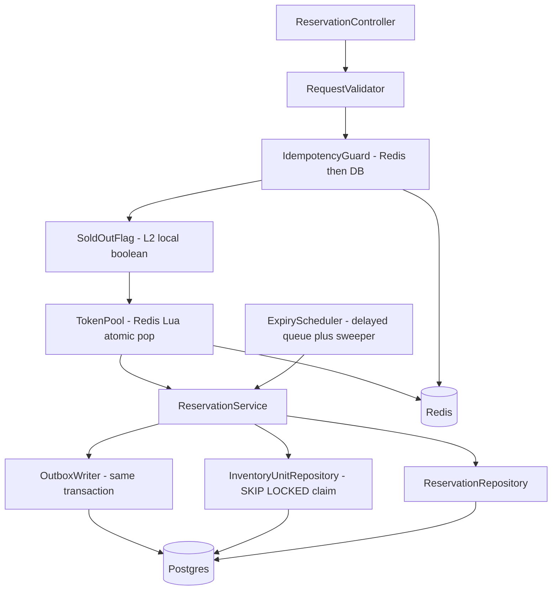
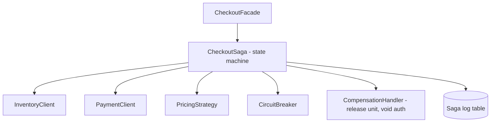

# 02 – Component Diagram (critical services)

## Inventory & Reservation Service

## Checkout Orchestrator

| Component | Responsibility |
|---|---|
| IdempotencyGuard | Replays the stored response for a repeated key; blocks duplicate business work |
| SoldOutFlag | Local boolean flipped by `StockSoldOut` event – zero network cost "NO" |
| TokenPool | Atomic admission: 100 tokens, one per successful entrant |
| ReservationService | Transaction: claim unit row, insert reservation, write outbox event |
| ExpiryScheduler | Releases expired reservations (delayed queue, with periodic sweeper as fallback) |
| CheckoutSaga | Orders steps: reserve → authorize → (async) order → capture; triggers compensations |

> **Defend it**
> - "Validation and idempotency happen *before* we touch stock, so duplicates never cost a lock."
> - "The outbox row is written in the same transaction as the reservation – no event is ever lost."
