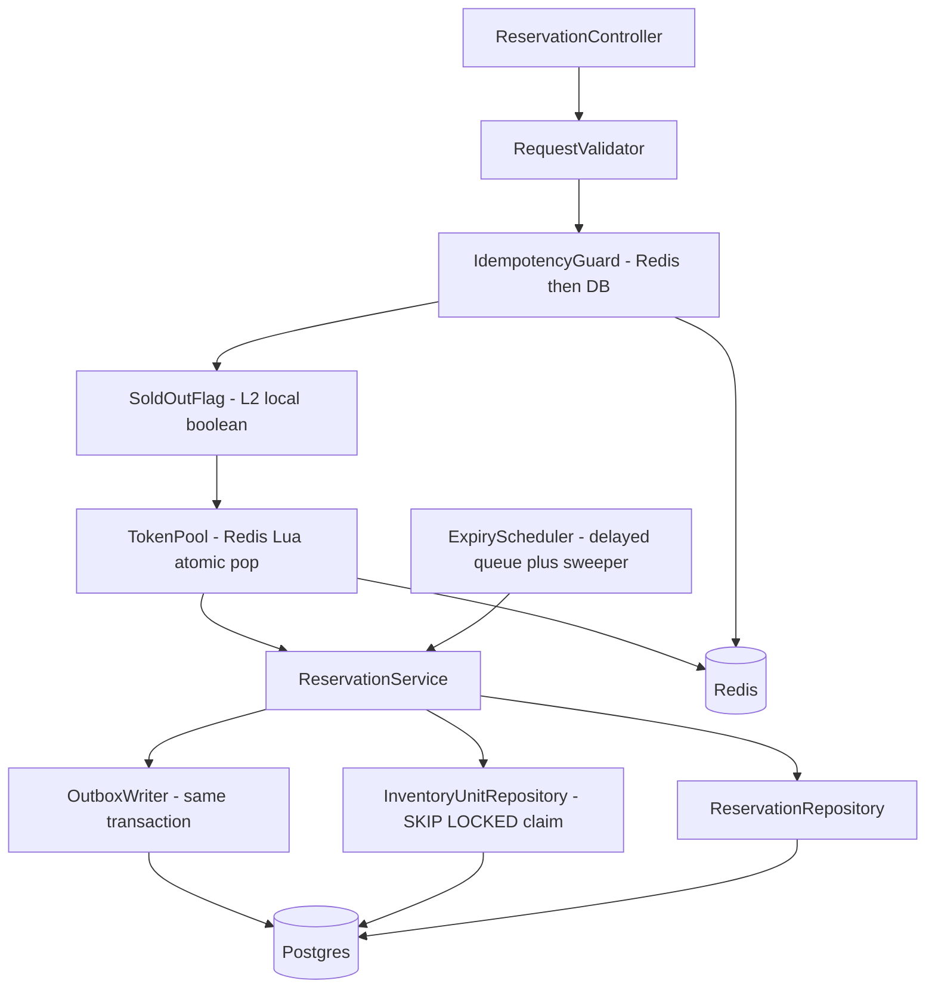
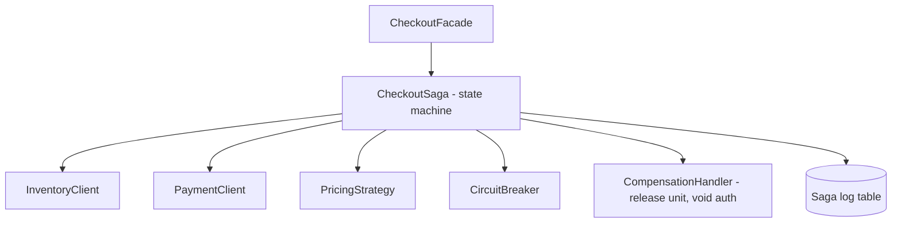

# 02 – Component Diagram (critical services)

*Editable source: [`drawio/component.drawio`](drawio/component.drawio) — open in [app.diagrams.net](https://app.diagrams.net).*

## Inventory & Reservation Service

## Checkout Orchestrator

| Component | Responsibility |
|---|---|
| IdempotencyGuard | Replays the stored response for a repeated key; blocks duplicate business work |
| SoldOutFlag | Local boolean flipped by `StockSoldOut` event – zero network cost "NO" |
| TokenPool | Atomic admission: 100 tokens, one per successful entrant |
| ReservationService | Transaction: claim unit row, insert reservation, write outbox event |
| ExpiryScheduler | Releases expired reservations (delayed queue, with periodic sweeper as fallback) |
| CheckoutSaga | Orders steps: reserve → authorize → (async) order → capture; triggers compensations |

> **Defend it**
> - "Validation and idempotency happen *before* we touch stock, so duplicates never cost a lock."
> - "The outbox row is written in the same transaction as the reservation – no event is ever lost."

## Resilience components (red text in the diagram)
| Component | Job |
|---|---|
| `LoadShedder` | Rejects early (503 + Retry-After) when queue wait would exceed 300 ms |
| `RetryBudget` + `BackoffWithJitter` | Retries ≤ 10% of calls, full jitter, idempotent calls only |
| `SingleflightCache` | One DB read per key per miss |
| `HotKeySaltedTokenPool` | 16 Redis sub-pools for the sale SKU |
| `LeaseManager` → `FencingToken` | Sweeper writes rejected if the token is stale |
| `PhiAccrualDetector` | Marks slow-but-alive PSP endpoints as suspect |
