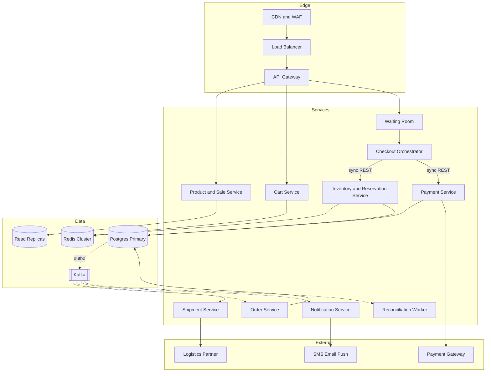

# 02 – Container / Service Diagram

Solid arrows = synchronous; dotted = asynchronous events.

| Container | Tech (proposed) | Owns data |
|---|---|---|
| Product & Sale | Spring Boot/Node + Caffeine (L2) | product, category, sale, deal, coupon |
| Cart | Service + Redis | cart, cart_item |
| Inventory & Reservation | Service + Redis tokens + Postgres | inventory, inventory_unit, inventory_reservation |
| Payment | Service + Postgres | payment, idempotency_record |
| Order | Service + Postgres | orders, order_item |
| Shipment / Notification | Services | shipment, notification |
| Checkout Orchestrator | Stateless + saga state table | saga log |

> **Defend it**
> - "Each service owns its own tables – no shared writes, so boundaries stay clean."
> - "Only two sync hops on the critical path: reserve and authorize."
