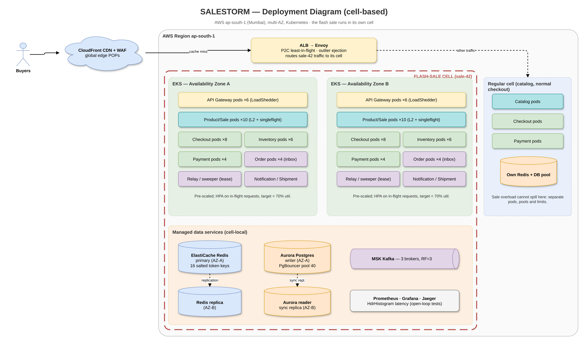
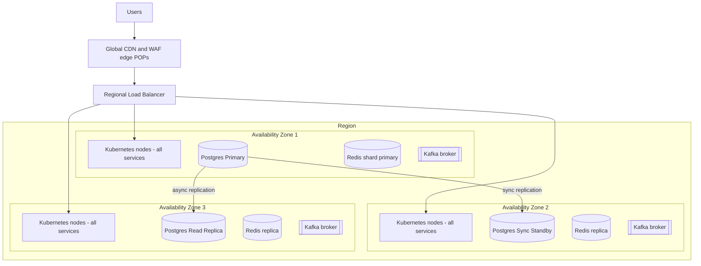

# 02 – Deployment Diagram

*Editable source: [`drawio/deployment.drawio`](drawio/deployment.drawio) — open in [app.diagrams.net](https://app.diagrams.net).*

| Element | Deployment choice | Why |
|---|---|---|
| Services | Kubernetes, stateless pods, HPA on CPU + request rate; **pre-scaled before sale** | Autoscaling is too slow for a 1-second spike |
| Postgres | Primary + synchronous standby (RPO≈0) + read replicas for catalog | Money and stock need zero data loss |
| Redis | Cluster, 3 shards × replica, AOF on | L3 speed; loss only slows us (DB is truth) |
| Kafka | 3 brokers, replication factor 3, `acks=all` | Durable events across AZs |
| CDN | Edge POPs, WAF rules, bot management | L1 tier; protects origin |
| Secrets | Vault / cloud secrets manager | No secrets in images |
| Observability | Prometheus, Grafana, OpenTelemetry, ELK | Metrics, traces, logs |

> **Defend it**
> - "We pre-scale before the sale because autoscalers take minutes and the spike takes one second."
> - "Losing an AZ loses no orders: sync standby for Postgres, RF=3 for Kafka."

## Cell-based deployment
The flash sale runs in its own **cell** (red dashed line): dedicated pods, Redis, PgBouncer pool (40 connections) and rate limits, routed by `sale_id` at the ALB/Envoy layer. Regular catalog and checkout run in a separate cell, so overload or a bad deploy in the sale cell can't spill over. Inside the cell, Envoy uses power-of-two-choices (least in-flight of 2 random pods) with outlier ejection. HPA scales on in-flight requests with a 70% utilization target (Little's law sizing in [Production_Failure_Modes.md](Production_Failure_Modes.md#10-littles-law-capacity-sizing)). See [ADR-010](../10_ADR/ADR-010-cell-isolation-and-open-loop-testing.md).
