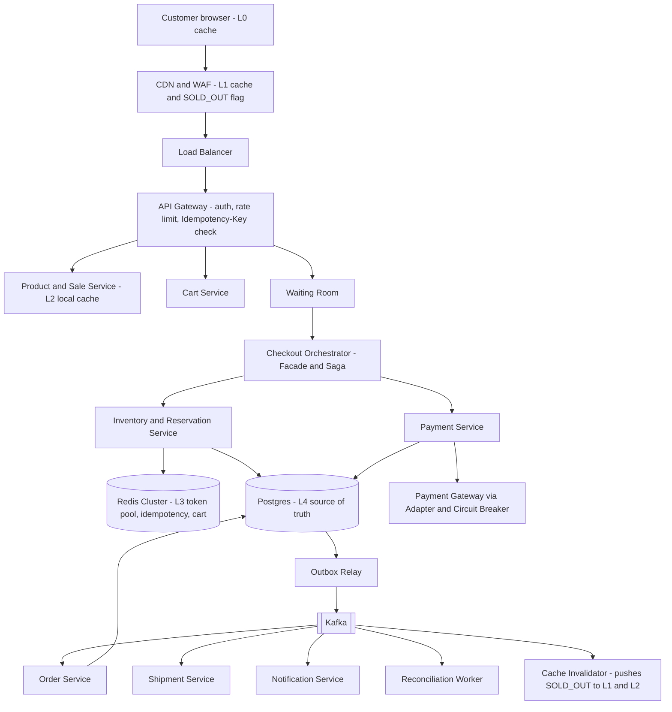
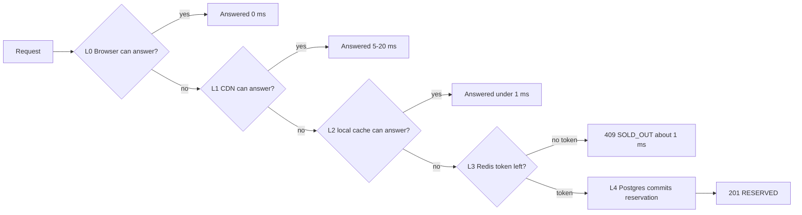

# 02 – High-Level Architecture

## 1. Architecture

## 2. The Cache-Hit Ladder (our unique factor)

| Tier | Allowed to answer | NEVER allowed to |
|---|---|---|
| L0 Browser | Static page, countdown, debounce repeat clicks | Decide stock |
| L1 CDN | Pages, images, `SOLD_OUT` flag (short TTL + purge on event) | Say "reserved" |
| L2 In-process | Product/sale config, local sold-out boolean | Say "reserved" |
| L3 Redis | Admission yes/no (100 tokens), idempotent replay of a past response | Be the final record of a sale |
| L4 Postgres | Commit reservation, payment, order | — (source of truth) |

**Rule: caches can say NO; only the database can say YES.** A token from Redis only *admits* a request to the DB; the DB still claims a real unit row inside a transaction. If Redis wrongly admits extra requests, the DB rejects them. If Redis loses tokens, we sell slightly slower, never more.

**Keeping caches correct:** invalidation is event-driven (`StockSoldOut`, `StockReleased` events from the outbox → CDN purge + pub/sub to L2), TTLs with jitter as a safety net, versioned keys (`sale:42:v7`). **Stampede protection:** caches pre-warmed before sale start, single-flight request coalescing, jittered TTLs.

## 3. Why each component exists
| Component | Reason |
|---|---|
| CDN + WAF | Absorbs ~80–90% of traffic (est.), blocks bots, serves `SOLD_OUT` at the edge |
| Load Balancer | Spreads traffic across gateway instances in 3 AZs |
| API Gateway | One place for auth, rate limiting, Idempotency-Key validation |
| Waiting Room | Turns a spike into a controlled flow instead of a crash |
| Product/Sale Service | Read-heavy catalog with L2 cache; stateless, scales out |
| Cart Service | Cart state in Redis; not on the critical stock path |
| Checkout Orchestrator | Facade over the purchase flow; runs the saga and compensations |
| Inventory & Reservation | **The only place stock correctness is enforced** |
| Payment Service | Talks to gateways through adapters; owns idempotency of money |
| Order / Shipment / Notification | Async consumers; failure doesn't lose money or stock |
| Redis | Fast admission and idempotency (L3) |
| Postgres | ACID source of truth for stock, money and orders (L4) |
| Kafka + Outbox | Reliable events; Order Service can be down without losing payments |
| Reconciliation Worker | Fixes stuck states: timeouts, orphan payments, expired reservations |

## 4. Synchronous vs asynchronous
| Interaction | Mode | Why |
|---|---|---|
| Browse / stock status | Sync (cached) | User needs immediate answer |
| Reserve unit | **Sync** | User must know now: reserved or sold out |
| Payment authorize | **Sync** (with timeout) | User is waiting at checkout |
| Order creation | **Async** (event) | Must survive Order Service outage |
| Payment capture | Async after order persisted | Never charge without an order |
| Shipment, notification | Async | Slow external partners |
| Cache invalidation | Async (event) | Fan-out to CDN and every pod |

## 5. Likely bottlenecks
| Bottleneck | Mitigation |
|---|---|
| Single hot inventory row | 100 unit rows + `SKIP LOCKED` – each buyer locks a different row |
| Origin flooded at sale start | CDN + waiting room + Redis tokens ⇒ ~105 DB writes |
| Redis hot key (token pool) | Lua atomic pop; shard pool across keys at 50×; local sold-out flag stops calls once empty |
| Payment gateway latency | Timeouts, circuit breaker, async capture, reconciliation |
| Kafka consumer lag | Partition by order_id, autoscale consumers, alert on lag |

> **Defend it**
> - "Inventory is the single consistency boundary; everything else can be eventually consistent."
> - "Reserve and authorize are sync because the user is waiting; order creation is async so an Order outage loses nothing."
> - "Our DB sees about 105 writes, not 10,000 – the ladder absorbs the rest."
