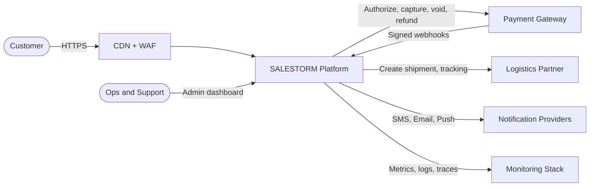

# 02 – System Context Diagram

| Actor / System | Why it is outside our boundary |
|---|---|
| Customer | Browses and buys; untrusted input |
| CDN + WAF | Edge tier **L1** of the Cache-Hit Ladder; absorbs most traffic and bots |
| Payment Gateway | External, can be slow or fail ⇒ wrapped by Adapter + Circuit Breaker |
| Logistics Partner | External delivery; wrapped by DeliveryPartnerAdapter |
| Notification Providers | External SMS/email/push; async only |
| Ops | Monitors sale, handles refunds and reconciliation |

> **Defend it**
> - "Every external system sits behind an adapter, so a slow partner can never block a stock decision."
> - "The CDN is part of our design, not just hosting – it is tier L1 of our cache ladder."
