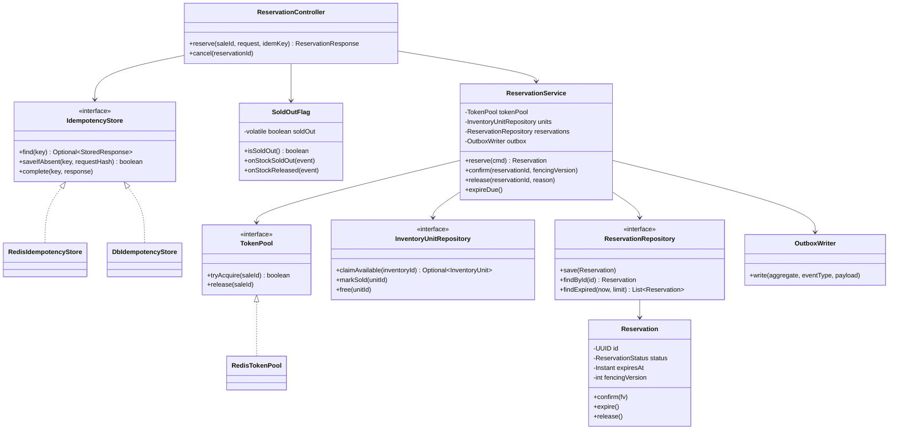
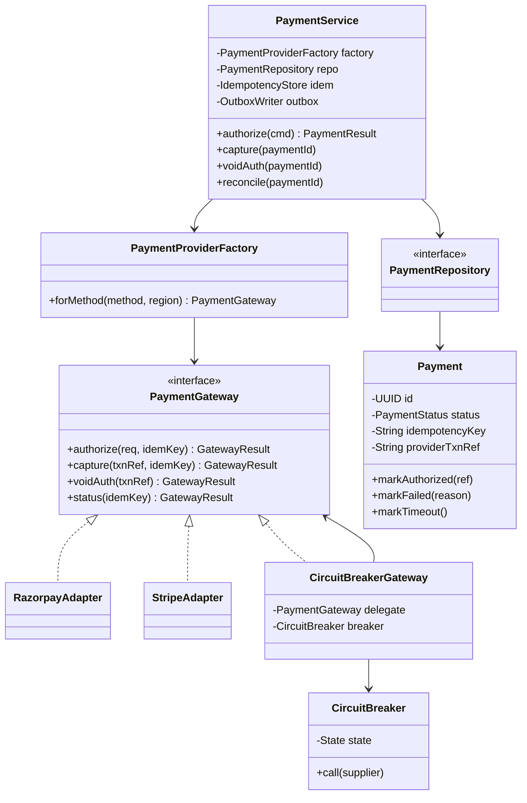
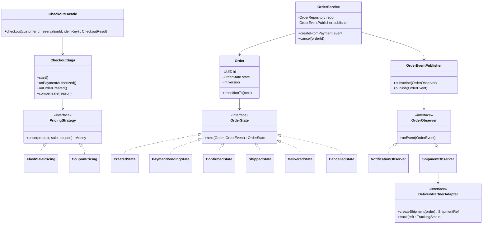

# 03 – Class Diagrams (Inventory, Payment, Order)


*Editable source: [`drawio/class_diagram.drawio`](drawio/class_diagram.drawio) — open in [app.diagrams.net](https://app.diagrams.net).*


## Inventory & Reservation module


## Payment module


## Order & Checkout module


## Resilience module (added)
The bottom (red) zone of the class diagram. All of them sit behind small interfaces so they can be unit-tested and swapped.

| Class | Responsibility | Used by | Pattern |
|---|---|---|---|
| `RetryBudget` | Allows a retry only while retries ≤ 10% of calls in a sliding window | `RetryingClient` | Token bucket |
| `BackoffWithJitter` | `delay = random(0, min(cap, base·2^attempt))`, base 100 ms, cap 2 s | `RetryingClient`, outbox relay | Strategy |
| `RetryingClient<T>` | Wraps an outbound call; refuses to retry non-idempotent ops | Payment, Inventory clients | Decorator |
| `AdmissionController` / `LoadShedder` | Admit or reject (503 + Retry-After) based on in-flight count and 300 ms deadline | Gateway, `CheckoutController` | Strategy |
| `SingleflightCache<K,V>` | One in-flight load per key; TTL ± 20% jitter | Product/Sale service (L2) | Proxy |
| `HotKeySaltedTokenPool` | `TokenPool` over 16 Redis keys, fallback probing, per-node empty hints | `ReservationService` | Strategy (new `TokenPool`) |
| `HedgedReadClient` | Sends a second read after p95; idempotent reads only | Product/stock-status reads | Decorator |
| `LeaseManager` / `FencingToken` | Acquire/renew Postgres lease; token only increases | `ReservationExpiryJob`, outbox relay, reconciler | – |
| `InboxDeduplicator` | `INSERT … ON CONFLICT DO NOTHING` into `inbox_message` in the caller's TX | `OrderService`, observers | Template Method |
| `OutlierDetector` / `PhiAccrualDetector` | Suspicion level per endpoint from real latencies/errors | `CircuitBreakerGateway`, `P2CLoadBalancer` | Strategy |
| `P2CLoadBalancer` | Pick 2 random healthy backends, use the one with fewer in-flight | Service clients / Envoy config | – |
| `WatermarkTracker` | Tracks event-time watermark; flags late events | Reconciliation, analytics, expiry | – |

```java
// The whole retry policy in one place
<T> T call(Supplier<T> op, boolean idempotent) {
  for (int attempt = 0; ; attempt++) {
    budget.onCall();
    try { return op.get(); }
    catch (TransientException e) {
      if (!idempotent || attempt >= 2 || !budget.tryRetry()) throw e;   // fail fast
      sleep(backoff.delay(attempt));                                     // full jitter
    }
  }
}
```

## Where validation, idempotency and error handling live
| Concern | Location |
|---|---|
| Input validation (schema, ranges) | API Gateway + `ReservationController` (DTO validation) |
| Business validation (sale live, one per customer) | `ReservationService` + DB unique constraints |
| Idempotency | `IdempotencyStore` before any work; DB unique keys as final guard |
| Error handling (retry, breaker) | `CircuitBreakerGateway`, consumer retry + DLQ, `CheckoutSaga.compensate` |
| State rules | `OrderState` / `Reservation` methods (illegal transitions throw) |

> **Defend it**
> - "Services depend on interfaces – `TokenPool`, `PaymentGateway`, `InventoryUnitRepository` – so Redis or Razorpay can be swapped without touching business logic."
> - "Idempotency is checked before work, and DB unique keys catch anything that slips through."
