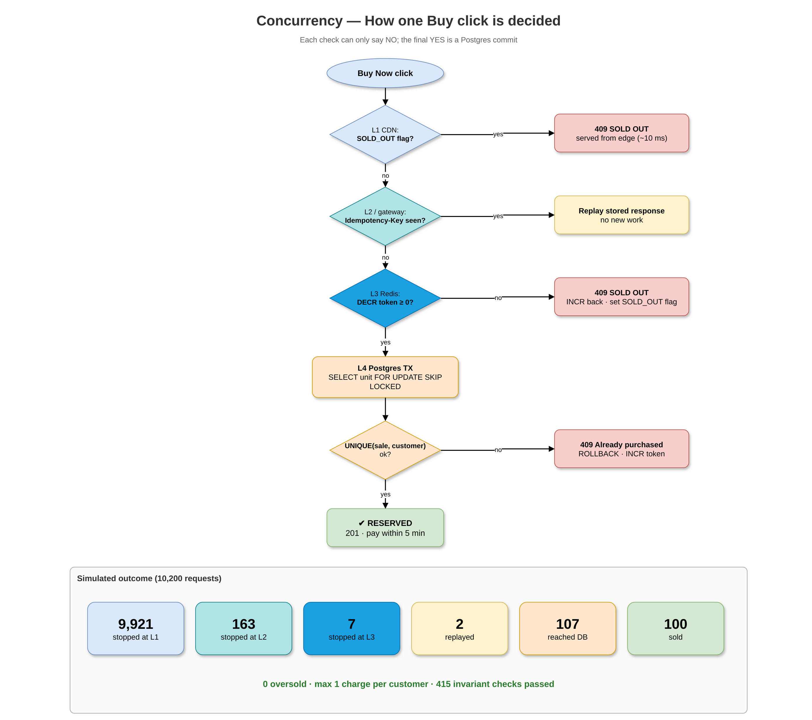
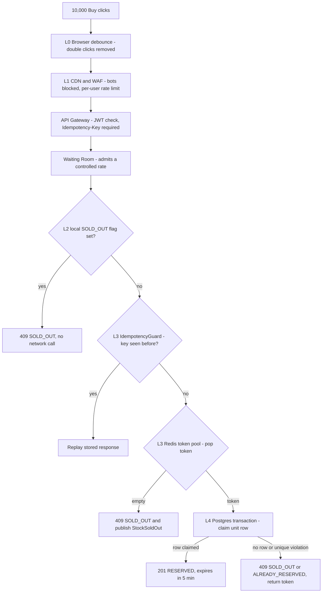
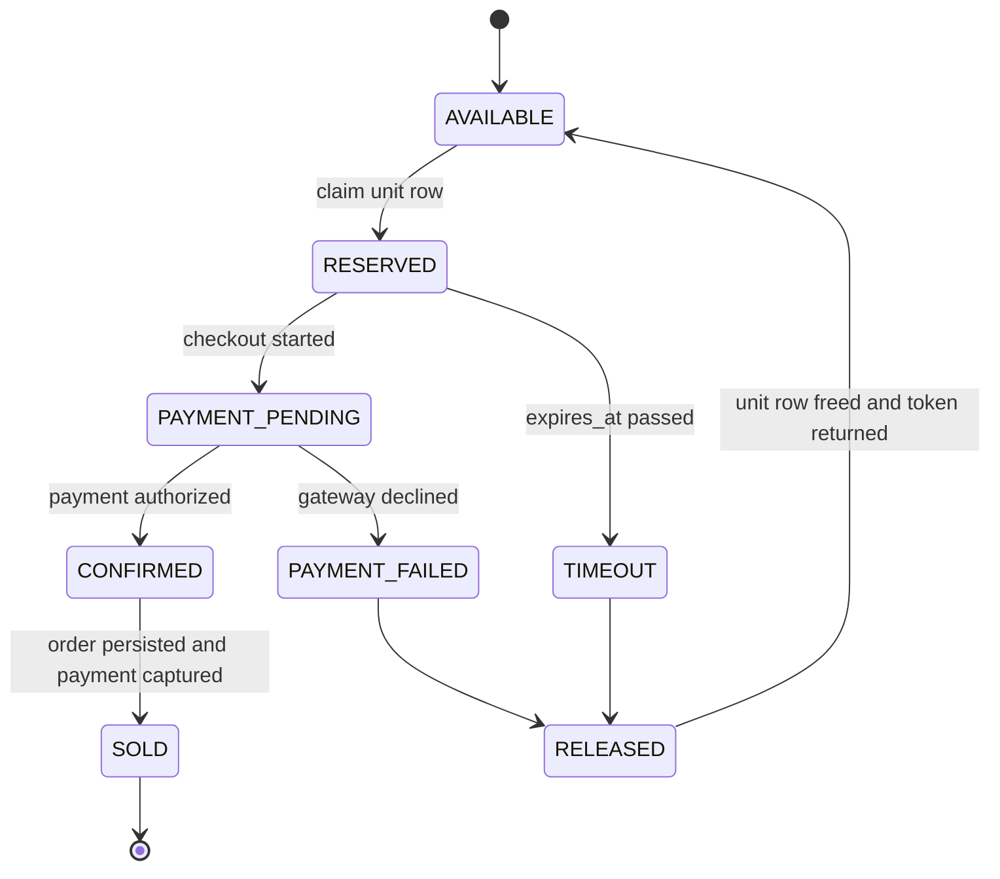

# 03 – Concurrency & Inventory Reservation Design (Phase II)



*Editable source: [`drawio/concurrency_flow.drawio`](drawio/concurrency_flow.drawio) — open in [app.diagrams.net](https://app.diagrams.net).*


> **Where is inventory consistency guaranteed?** In exactly one place: the Postgres transaction inside the Inventory & Reservation Service that claims a row in `inventory_unit`. Everything before it (CDN, local cache, Redis) only filters. **Caches can say NO; only the database can say YES.**

## 1. How 10,000 requests enter and get filtered


| Where | What happens to requests | Approx. count (estimate) |
|---|---|---|
| Throttled | CDN/WAF rate limit, gateway per-user limit (e.g. 1 Buy per user per 2 s) | duplicates, bots |
| Queued | Waiting room admits N per second | spike flattened |
| Rejected cheaply | Local sold-out flag (L2), empty token pool (L3) | ~9,900 |
| Reach DB | Token holders only | ~100 (+ ~5 resales) |
| **Contention controlled** | **`SELECT … FOR UPDATE SKIP LOCKED` on `inventory_unit`** | the only lock point |

## 2. Reservation creation (one transaction)
```sql
BEGIN;
-- 1. claim any free unit; other transactions skip locked rows instead of waiting
SELECT unit_id FROM inventory_unit
 WHERE inventory_id = :inv AND status = 'AVAILABLE'
 ORDER BY unit_id
 FOR UPDATE SKIP LOCKED
 LIMIT 1;                                   -- none returned => SOLD_OUT

-- 2. mark it reserved
UPDATE inventory_unit SET status='RESERVED', reservation_id=:rid, version=version+1
 WHERE unit_id = :unit;

-- 3. one reservation per customer per sale (UNIQUE(sale_id, customer_id)) + idempotency key UNIQUE
INSERT INTO inventory_reservation(reservation_id, product_id, unit_id, customer_id, sale_id,
       status, expires_at, idempotency_key, business_key, fencing_version)
VALUES (:rid, :product, :unit, :cust, :sale, 'RESERVED', now() + interval '5 minutes', :key, sha256(:cust||:sale||:product), 1);

-- 4. keep aggregate counters honest (CHECK constraints guard them)
UPDATE inventory SET available = available - 1,
                     reserved  = reserved + 1,
                     version = version + 1, updated_at = now()
 WHERE inventory_id = :inv;

-- 5. event in the same transaction (transactional outbox)
INSERT INTO outbox_event(aggregate_type, aggregate_id, event_type, payload)
VALUES ('reservation', :rid, 'ReservationCreated', :json);
COMMIT;
```
Safety nets that hold **even if the code has a bug**: `CHECK (available >= 0)`, `CHECK (available + reserved + sold = total_quantity)`, `UNIQUE (sale_id, customer_id)`, `UNIQUE (idempotency_key)`, `UNIQUE (unit_id) WHERE status active`.

> Note: the aggregate `inventory` row is updated once per successful reservation – about 105 times in the whole sale – so it is not a hot spot. The contended decision (*which* unit) happens on 100 separate rows.

## 3. Lifecycle: confirmation, expiry, release


| Step | Trigger | Action (single transaction) |
|---|---|---|
| Confirm | `PaymentAuthorized` | `UPDATE reservation SET status='CONFIRMED' WHERE id=:rid AND fencing_version=:fv AND status='PAYMENT_PENDING'` |
| Sell | Order persisted + capture ok | unit → SOLD; reserved−1, sold+1 |
| Expire | Delayed message at `expires_at` (sweeper every 5 s as fallback: `WHERE status IN ('RESERVED') AND expires_at < now()` using index `(status, expires_at)`) | reservation → TIMEOUT → RELEASED |
| Release | Expire / payment failed / cancel | unit → AVAILABLE; available+1, reserved−1; **return token to Redis**; publish `StockReleased` (clears SOLD_OUT flag at L1/L2) |

**While a payment authorization is held, the reservation is extended** (e.g. +10 min) so an Order Service outage can't make us release a paid unit.

## 4. The race nobody else will cover: expiry vs late payment (fencing)
Reservation expires at 10:00:00; the gateway confirms payment at 10:00:01.
- Every reservation carries `fencing_version`. Expiry increments it.
- The payment confirmation only succeeds if `fencing_version` still matches.
- If it doesn't match: try to claim **another free unit** for the same customer (same transaction). If none is free → **void the authorization** (no money taken, because we authorize-then-capture). Customer gets a clear "reservation expired, you were not charged" message.

## 5. The last-unit scenario (deterministic)
Two requests A and B, one unit left, both hold Redis tokens (e.g. token returned by a release):
1. A and B both run `SELECT … FOR UPDATE SKIP LOCKED LIMIT 1`.
2. Postgres gives the row lock to whichever transaction gets it first (say A); B **skips** the locked row and finds nothing.
3. A commits → 201 RESERVED. B gets 0 rows → 409 SOLD_OUT immediately (no waiting, no deadlock).
4. If A later fails payment, the unit is released and becomes claimable again.

## 6. Duplicate requests
| Duplicate type | Caught at | Result |
|---|---|---|
| Double click | L0 debounce | never sent |
| Network retry, same Idempotency-Key | L3 Redis idempotency cache → DB `idempotency_record` | stored response replayed (200), no new work |
| New key, same customer & sale | Business key `hash(customer, sale, product)` + `UNIQUE(sale_id, customer_id)` | 409 ALREADY_RESERVED with existing reservation id |
| Two concurrent identical requests | `INSERT idempotency_record … ON CONFLICT DO NOTHING` – only one wins, other waits/replays | one reservation |

## 7. Comparing concurrency approaches
| Approach | How it works | Under 10k/100 contention | Correctness | Verdict |
|---|---|---|---|---|
| Redis-only `DECR` | Atomic counter in Redis | Very fast | Redis failover can lose writes ⇒ possible oversell; no durable record | Used **only as admission filter** |
| Pessimistic lock on one counter row (`SELECT … FOR UPDATE`) | Everyone queues on one row | All requests serialize on one hot row ⇒ latency spike, lock timeouts | Correct | Rejected – hot row |
| Optimistic locking (`version` column) | Read, then `UPDATE … WHERE version = :v` | Most updates fail and retry ⇒ retry storm | Correct | Good for low contention (cart, order updates), not for the sale |
| Conditional atomic update `UPDATE … SET available=available-1 WHERE available>=1` | Single statement, row lock briefly | Still one hot row, but short | Correct | **Fallback** when Redis is down |
| **Unit rows + `FOR UPDATE SKIP LOCKED`** | 100 rows, each buyer locks a different one, others skip | Contention spread over 100 rows; no waiting | Correct + per-unit audit trail | **Selected** |

**Why we chose it:** it turns "10,000 people fighting over one number" into "100 separate locks nobody waits on", gives a deterministic last-unit result, and leaves an audit trail per physical unit. Trade-off: 100 rows per sale product (trivial storage) and a little more SQL complexity; for products with huge stock (e.g. 1 million) we'd switch to the conditional update on sharded counter rows.

## 8. Transaction boundaries & consistency guarantees
| Boundary | Inside one ACID transaction | Consistency |
|---|---|---|
| Reserve | claim unit + reservation insert + counters + outbox | **Strong** |
| Release | unit free + reservation status + counters + outbox | **Strong** |
| Confirm/sell | reservation + unit + counters + outbox | **Strong** |
| Redis token pool, L1/L2 sold-out flags | outside DB | **Eventual**, may only make us say NO too early for a moment – never YES wrongly |
| Order, shipment, notification | separate services via events | **Eventual** (seconds) |

**Redis failure mode:** if Redis is down, the gateway sends a limited rate of requests straight to the DB path (conditional update / SKIP LOCKED). Slower, still correct.

> **Defend it**
> - "Two requests hitting inventory at the same time lock *different* rows; on the last unit one gets it, the other skips and gets SOLD_OUT immediately."
> - "Redis tokens are a bouncer, not a cashier – Postgres constraints make overselling impossible even with a code bug."
> - "We handle the expiry-vs-late-payment race with a fencing version, and because we only authorize, a late payer is never charged."
