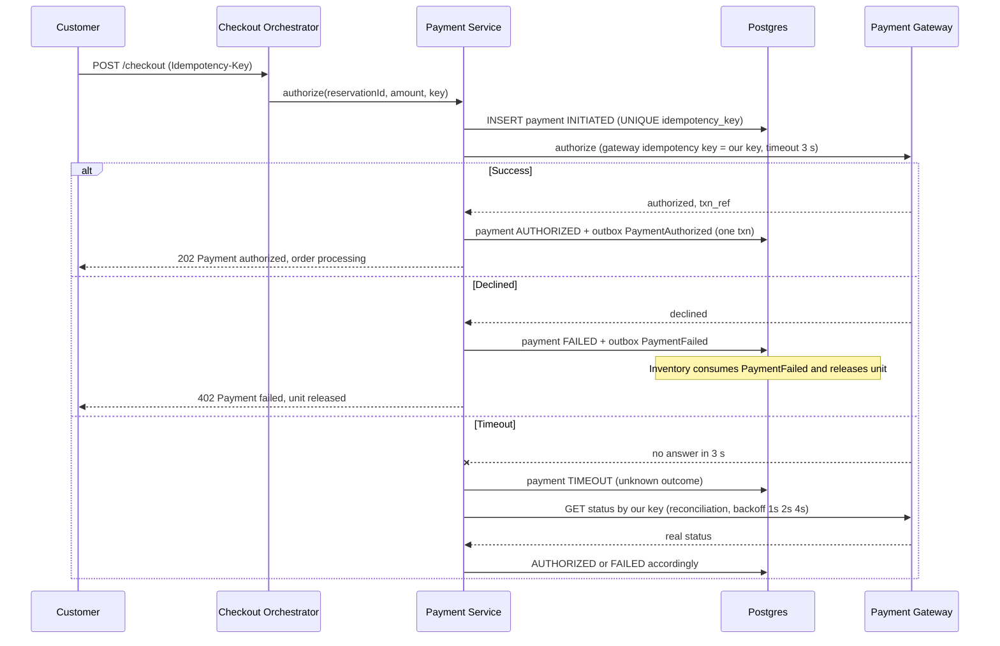
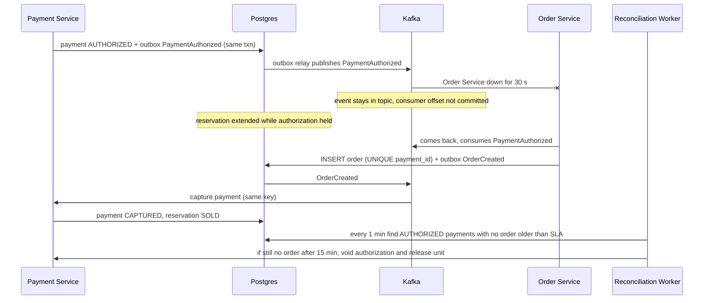
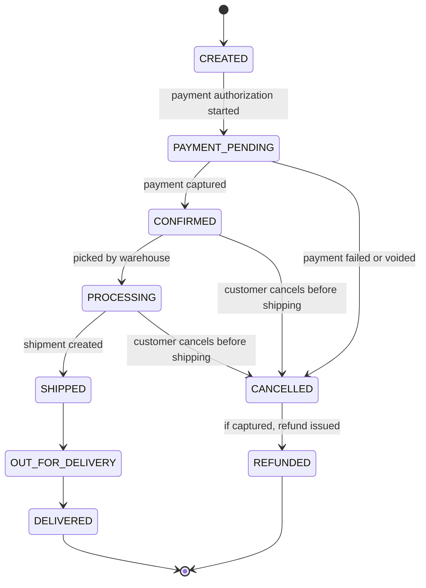

# 03 – Payment & Order Design (Phase III)

*Editable source: [`drawio/seq_payment.drawio`](drawio/seq_payment.drawio) — open in [app.diagrams.net](https://app.diagrams.net).*

*Editable source: [`drawio/seq_order_recovery.drawio`](drawio/seq_order_recovery.drawio) — open in [app.diagrams.net](https://app.diagrams.net).*

## 1. Core idea: authorize first, capture only after the order exists
| Step | What happens | Why |
|---|---|---|
| Authorize (sync) | Gateway holds the money on the card; nothing is charged yet | If anything later fails we **void** – no refund needed |
| Order persisted (async) | Order Service consumes `PaymentAuthorized` and writes the order | Survives Order Service outages via outbox + Kafka |
| Capture (async) | Payment Service captures after `OrderCreated` | Money is taken only when an order definitely exists |

Guarantee G4: *every captured payment has exactly one order; every authorization without an order is voided.*

## 2. Payment flows

| Scenario | Response |
|---|---|
| **Success** | Payment AUTHORIZED → event → order created → capture → reservation SOLD |
| **Failure** | Payment FAILED → `PaymentFailed` → reservation PAYMENT_FAILED → RELEASED → unit + token back on sale |
| **Timeout** | Status is *unknown*, never assumed failed. We **query** the gateway by our idempotency key; never blindly re-send a charge. Reconciliation worker checks every TIMEOUT payment until resolved; reservation extended meanwhile |
| **Duplicate request** | Same Idempotency-Key ⇒ `UNIQUE(idempotency_key)` on payment and stored response replayed; same key sent to the gateway, so the gateway also deduplicates; `UNIQUE(provider_txn_ref)` blocks double recording of webhooks |
| **Payment ok, Order Service down** | See section 4 |

## 3. Retry, timeout and circuit breaker policy (numbers are design choices)
| Call | Timeout | Retry | Circuit breaker |
|---|---|---|---|
| Checkout → Inventory | 300 ms | none (user can retry with same key) | open after 50% errors in 10 s |
| Payment → Gateway authorize | 3 s | **no blind retry**; status query with backoff 1-2-4 s, max 5 | open after 50% failures / 20 calls; half-open probe after 30 s; while open: "payments temporarily unavailable", reservations kept |
| Payment → Gateway capture/void | 5 s | retry with same key, exponential backoff + jitter, max 10, then DLQ + alert | same breaker |
| Kafka consumers | — | 5 retries with backoff, then **dead-letter topic** + alert; consumer is idempotent | — |

**Retry rules we apply everywhere (ADR-009):** only idempotent calls are retried (same `Idempotency-Key`); delays use exponential backoff with **full jitter** (`random(0, min(cap, base·2^n))`); a **retry budget** stops retries once they exceed 10% of calls; max 3 attempts on the user path. In our model this kept load at 1.01× during a blip, vs 4.26× for naive retries.

**Gray failure:** the payment client keeps a `PhiAccrualDetector` per PSP endpoint fed by real authorize latencies. An endpoint that still passes `/health` but authorizes slowly crosses φ = 8, is marked *suspect*, and new authorizations go elsewhere. The breaker handles "down"; phi handles "slow".

**Late webhooks:** every PSP event carries its own `occurred_at` (`payment.gateway_event_at`). If it's older than the watermark and the reservation already expired, the event goes to `reconciliation_case` (`VOID_AUTH` or `REFUND`), never into the main flow.

If the primary gateway's breaker is open, `PaymentProviderFactory` can route new authorizations to a secondary provider (Strategy + Adapter).

## 4. Payment succeeds, Order Service fails (30 s outage)

Why nothing is lost: the event is written **in the same transaction** as the payment (outbox), Kafka stores it durably, and the order consumer is idempotent (`UNIQUE(payment_id)` on orders) so redelivery after recovery can never create two orders. Compensation (void + release) runs only if recovery takes longer than the SLA.

### Inbox at every consumer
Kafka gives at-least-once. Order, Notification and Shipment each insert `(consumer, message_id)` into `inbox_message` in the same TX as their work; 0 rows inserted means "already done". In `resilience_sim.py` the outage produced 113 deliveries for 100 payments: 13 duplicate orders without the inbox, 0 with it.

## 5. Order lifecycle

| From | To | Trigger | Side effects |
|---|---|---|---|
| CREATED | PAYMENT_PENDING | `PaymentAuthorized` consumed | — |
| PAYMENT_PENDING | CONFIRMED | capture succeeded | reservation SOLD; notify customer |
| PAYMENT_PENDING | CANCELLED | capture/authorization failed or voided | release unit; notify |
| CONFIRMED / PROCESSING | CANCELLED | customer cancel | refund; unit back to stock if sale still live |
| CANCELLED | REFUNDED | refund confirmed by gateway | audit log |
| PROCESSING → … → DELIVERED | shipment events | delivery partner webhooks | notifications |

Illegal transitions (e.g. DELIVERED → PROCESSING) are rejected by the **State pattern**: each state class only implements the moves it allows. Every transition writes `audit_log` + an outbox event. Updates use optimistic locking (`version`) since order rows have low contention.

## 6. Recovery summary
| Failure | Recovery |
|---|---|
| Gateway timeout | Status query by idempotency key; reconciliation worker; never re-charge |
| Gateway down | Circuit breaker opens; fail fast; secondary provider or "try again" while reservation held |
| Order Service down | Events wait in Kafka; idempotent replay on recovery; void after SLA |
| Capture fails repeatedly | DLQ + alert; reconciliation retries; order stays PAYMENT_PENDING (not CONFIRMED) |
| Duplicate webhook | `UNIQUE(provider_txn_ref)` + idempotent handler |
| Nightly | Reconciliation compares gateway settlement report vs `payment` table |

> **Defend it**
> - "We authorize first and capture only after the order exists, so an Order outage never leaves a customer charged without an order."
> - "A timeout means *unknown*, not *failed* – we ask the gateway with the same key instead of charging again."
> - "Redelivered events can't create a second order because orders are unique per payment."
