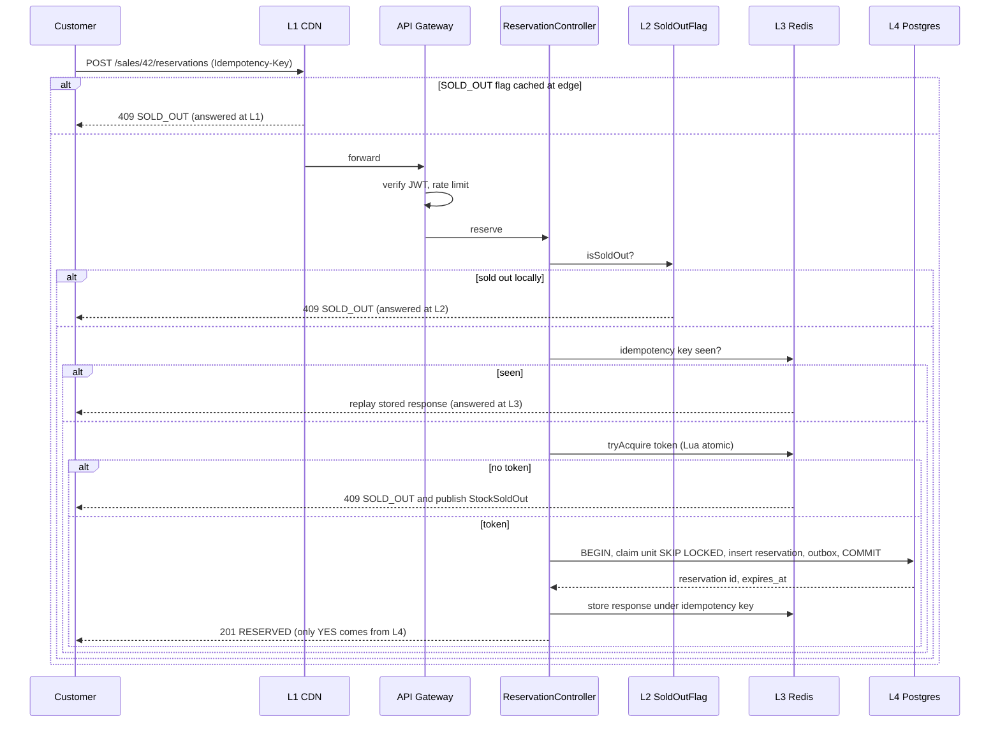
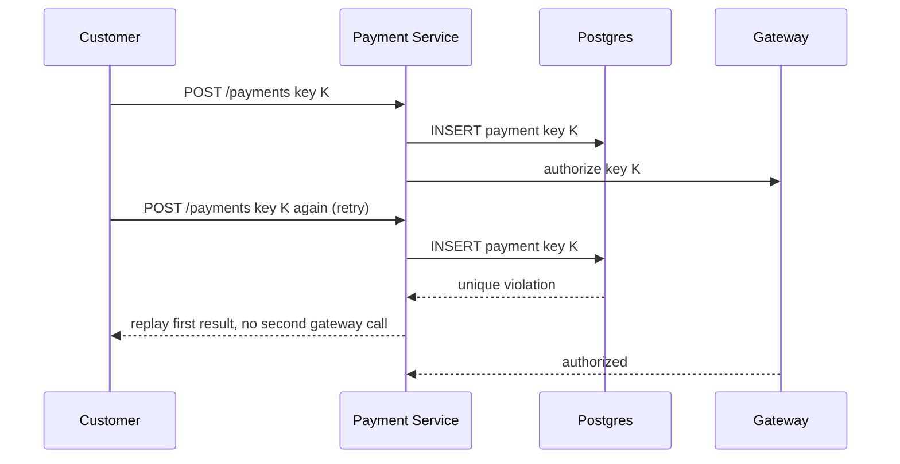
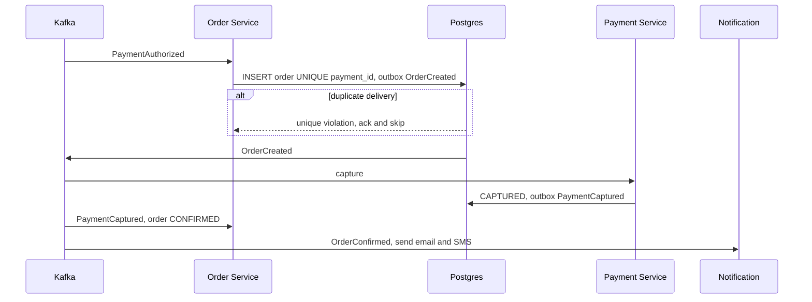

# 03 – Sequence Diagrams

## 1. Purchase / reservation (shows which cache tier answers)

## 2. Payment (success, decline, timeout, duplicate)
See `payment_order_design.md` section 2 for the full alt-block diagram. Duplicate path:

## 3. Order creation and recovery

Recovery from a 30 s Order outage: `payment_order_design.md` section 4.
