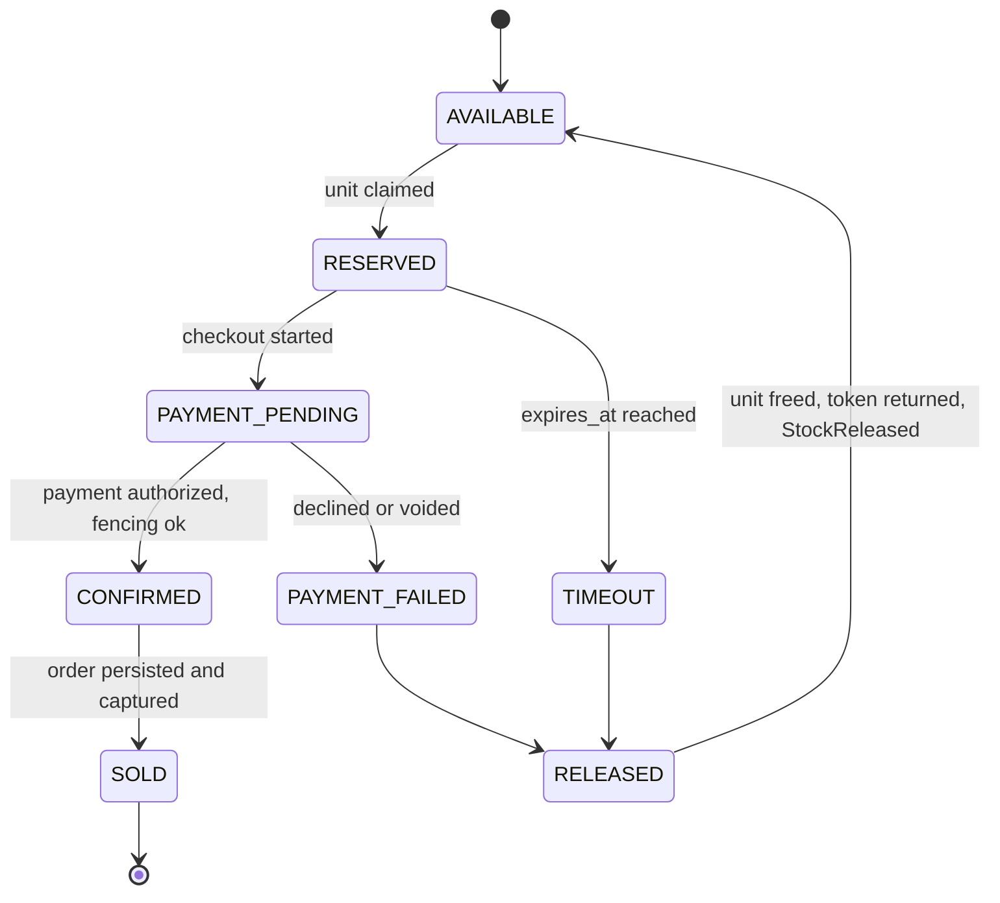
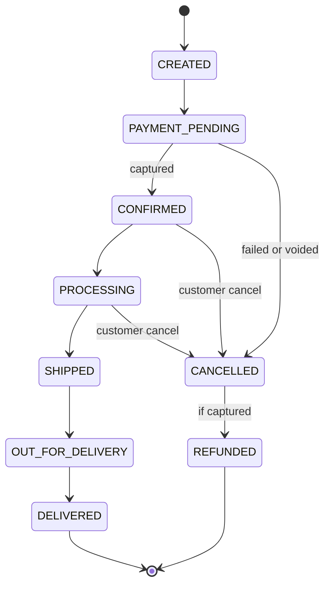

# 03 – State Diagrams

*Editable source: [`drawio/state_reservation.drawio`](drawio/state_reservation.drawio) — open in [app.diagrams.net](https://app.diagrams.net).*

*Editable source: [`drawio/state_order.drawio`](drawio/state_order.drawio) — open in [app.diagrams.net](https://app.diagrams.net).*

## Reservation lifecycle

Note: PAYMENT_PENDING does not time out while an authorization is held; it is extended and resolved by reconciliation.

## Order lifecycle

