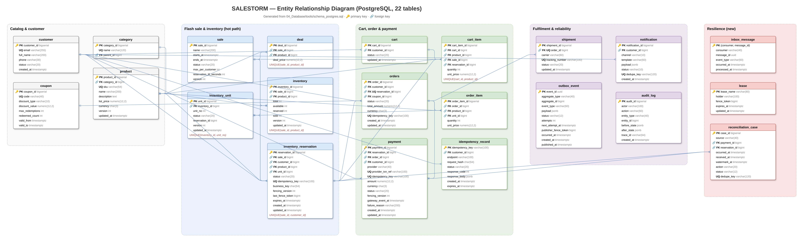
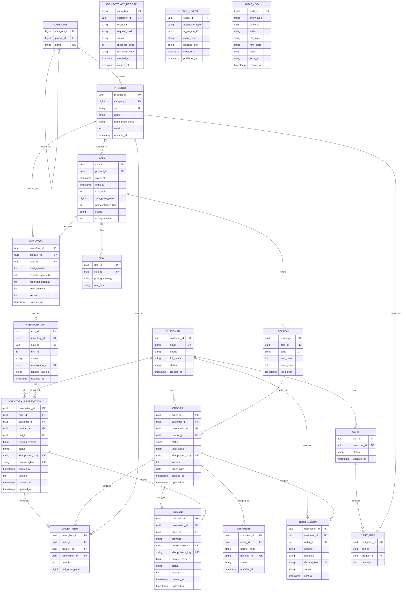

# 04 – Database Design (Postgres = L4, the source of truth)

*Editable source: [`drawio/er_diagram.drawio`](drawio/er_diagram.drawio) — open in [app.diagrams.net](https://app.diagrams.net).*

> **Rule we design around:** *Caches can say NO; only the database can say YES.*
> Redis (L3) may reject a buyer early, but a sale only exists when a Postgres transaction commits.
> All numbers in this document are **estimates** for reasoning, not measurements.

Tool files (machine-readable, built by another team member):
- `04_Database/tools/schema.sql` – runnable Postgres DDL
- `04_Database/tools/salestorm.dbml` – paste into dbdiagram.io for a picture

If anything here disagrees with `schema.sql`, treat `schema.sql` as the executable version and fix this doc.

---

## 1. Why Postgres (short)
- Stock and money need **ACID**: "claim a unit + write the reservation + update counters" must be all-or-nothing.
- Postgres gives us `CHECK`, `UNIQUE`, `FOR UPDATE SKIP LOCKED`, partial indexes and partitioning out of the box.
- The flash-sale write volume reaching the DB is tiny (estimate **~100–105 writes for 10,000 clicks**) because L0–L3 filter the rest, so we do not need NoSQL write scale for the critical path. (See ADR-004.)

---

## 2. ER Diagram

`OUTBOX_EVENT`, `AUDIT_LOG` and `IDEMPOTENCY_RECORD` are infrastructure tables: they reference other rows by `aggregate_id` / `entity_id` / `customer_id`, kept loose on purpose (no hard FK on the polymorphic ids) so writes never fail on them.

Money is stored as **integer paise** (`bigint`), never floats.

---

## 3. Keys, constraints and indexes per table

| Table | PK | FKs | Unique / CHECK constraints | Indexes (why) |
|---|---|---|---|---|
| customer | customer_id (uuid) | – | UNIQUE(email) | email lookup at login |
| category | category_id | parent_id → category | UNIQUE(name) | – |
| product | product_id | category_id → category | UNIQUE(sku); CHECK(base_price_paise > 0) | (category_id) for listing |
| sale | sale_id | product_id → product | CHECK(ends_at > starts_at); CHECK(total_units > 0); CHECK(per_customer_limit >= 1) | (status, starts_at) for "upcoming sales" |
| deal | deal_id | sale_id → sale | – | (sale_id) |
| coupon | coupon_id | sale_id → sale | UNIQUE(code); CHECK(used_count <= max_uses) | (code) |
| **inventory** | inventory_id | product_id, sale_id | UNIQUE(sale_id, product_id); **CHECK(available_quantity >= 0)**, CHECK(reserved_quantity >= 0), CHECK(sold_quantity >= 0), **CHECK(available_quantity + reserved_quantity + sold_quantity = total_quantity)** | PK only (one row per sale/product) |
| **inventory_unit** | unit_id | inventory_id, sale_id, reservation_id | UNIQUE(sale_id, unit_no); CHECK(status IN ('AVAILABLE','RESERVED','SOLD')); CHECK((status='AVAILABLE') = (reservation_id IS NULL)) | **partial index (sale_id) WHERE status='AVAILABLE'** – makes `SKIP LOCKED LIMIT 1` find a free unit fast |
| **inventory_reservation** | reservation_id | sale_id, customer_id, product_id, unit_id | **UNIQUE(sale_id, customer_id)** (one live reservation per customer per sale, see note); UNIQUE(idempotency_key); UNIQUE(business_key); CHECK(status IN (...7 states...)) | **(status, expires_at)** partial WHERE status IN ('RESERVED','PAYMENT_PENDING') – the expiry sweeper; (customer_id) |
| idempotency_record | idem_key | customer_id | PK is the unique guard | (expires_at) for cleanup job |
| cart / cart_item | cart_id / cart_item_id | customer_id; cart_id, product_id | UNIQUE(cart_id, product_id); CHECK(quantity > 0) | (customer_id) WHERE status='ACTIVE' |
| **orders** | order_id | customer_id, reservation_id, coupon_id | **UNIQUE(reservation_id)** (one order per reservation – the order consumer's idempotency guard); UNIQUE(idempotency_key) | (customer_id, created_at DESC) for "my orders"; (status) partial for stuck-order recovery. **Partitioned by order_date (monthly)** |
| order_item | order_item_id | order_id, product_id, reservation_id | CHECK(quantity > 0) | (order_id) |
| **payment** | payment_id | reservation_id, order_id (nullable until order exists) | **UNIQUE(idempotency_key)**; **UNIQUE(provider, provider_txn_ref)**; CHECK(amount_paise > 0) | (status, updated_at) for reconciliation of AUTH_PENDING/UNKNOWN |
| shipment | shipment_id | order_id | UNIQUE(partner_code, tracking_no) | (order_id) |
| notification | notification_id | customer_id, order_id | **UNIQUE(dedupe_key)** = hash(event_id, channel) so a re-delivered event never sends twice | (status) |
| outbox_event | event_id | – (loose) | – | **partial (created_at) WHERE published_at IS NULL** – relay polls only unpublished rows |
| audit_log | audit_id (bigserial) | – (loose) | append-only (no UPDATE/DELETE grant) | (entity_type, entity_id, created_at); (trace_id) |

| **inbox_message** (new) | (consumer, message_id) | – (message_id = outbox_event.event_id) | PK is the dedupe guard: one row per consumer per message | (processed_at) for purge after Kafka retention |
| **lease** (new) | lease_name | – | CHECK(fence_token >= 0); token only increases | PK only |
| **reconciliation_case** (new) | case_id | payment_id, reservation_id | UNIQUE(dedupe_key); CHECK on source/action/status | partial (status, received_at) WHERE status='OPEN' |

**New columns:** `inventory_reservation.last_fence_token` (stale sweeper writes rejected), `outbox_event.occurred_at` (event time), `outbox_event.next_attempt_at` (backoff with jitter), `outbox_event.publisher_fence_token`, `payment.gateway_event_at` (PSP event time). **New index:** partial UNIQUE `uq_reservation_one_live_per_unit` (write-skew guard). All three schema files (Postgres, MySQL, DBML) carry these; the Postgres file now creates **22 tables** and was applied to PostgreSQL 17, and `tools/resilience_checks.sql` verifies fencing, inbox and write-skew behaviour on it.

**Note on UNIQUE(sale_id, customer_id):** a released reservation must not block the same customer from trying again. We implement it as a **partial unique index** `ON inventory_reservation(sale_id, customer_id) WHERE status IN ('RESERVED','PAYMENT_PENDING','CONFIRMED','SOLD')`. So: at most one *live or successful* reservation per customer per sale (per_customer_limit = 1 for Product X).

**business_key** = `sha256(customer_id | sale_id | product_id)`. Even if the client sends two different Idempotency-Keys (two tabs), the business key collides and the second insert fails → we return the first reservation.

---

## 4. Reservation status vs unit status

| inventory_reservation.status | inventory_unit.status | inventory counters |
|---|---|---|
| RESERVED | RESERVED | available −1, reserved +1 |
| PAYMENT_PENDING | RESERVED | unchanged |
| CONFIRMED (payment authorized) | RESERVED | unchanged |
| SOLD (order persisted + captured) | SOLD | reserved −1, sold +1 |
| PAYMENT_FAILED → RELEASED | AVAILABLE (fencing_version +1) | reserved −1, available +1 |
| TIMEOUT → RELEASED | AVAILABLE (fencing_version +1) | reserved −1, available +1 |

The brief's chain `AVAILABLE → RESERVED → PAYMENT_PENDING → CONFIRMED → SOLD` is the combined life of a unit and its reservation: "AVAILABLE" is the unit before anyone claims it.

---

## 5. Transaction boundaries

Each box = **one local Postgres transaction**. Nothing crosses a network call while holding a lock.

| # | Transaction | Statements (in order) | Locks held | Est. duration |
|---|---|---|---|---|
| T1 | **Reserve** | insert idempotency_record (or read existing) → `SELECT unit ... FOR UPDATE SKIP LOCKED LIMIT 1` → insert reservation → update unit → update inventory counters (last, so the counter row lock is held ~1 ms) → insert outbox `ReservationCreated` → insert audit_log | 1 unit row + inventory row (briefly) | ~3–5 ms (estimate) |
| T2 | **Start payment** | reservation RESERVED→PAYMENT_PENDING (`WHERE version=?`) → insert payment(AUTH_PENDING, idem key) → audit | reservation row | ~2 ms |
| T3 | **Payment authorized** | payment → AUTHORIZED, reservation → CONFIRMED (fenced, see §6), expires_at extended for the order SLA → outbox `PaymentAuthorized` → audit | reservation + unit row | ~3 ms |
| T4 | **Create order** (consumer) | insert orders + order_item (UNIQUE(reservation_id) makes replays no-ops) → outbox `OrderCreated` → audit | new rows only | ~3 ms |
| T5 | **Finalize sale** (after capture OK) | payment → CAPTURED, reservation → SOLD, unit → SOLD, counters reserved−1 sold+1, order → CONFIRMED → outbox `OrderConfirmed` → audit | unit + inventory row | ~3 ms |
| T6 | **Release** (fail / timeout) | reservation → PAYMENT_FAILED or TIMEOUT → RELEASED; unit → AVAILABLE, fencing_version+1, reservation_id NULL; counters reserved−1 available+1; outbox `ReservationReleased` (→ returns Redis token) → audit | unit + inventory row | ~3 ms |

Calls to the payment gateway, Kafka and Redis happen **between** transactions, never inside. The outbox row is how "DB commit" and "message publish" become atomic (no dual-write problem).

---

## 6. Concurrency control (summary – detail in `03_LLD/concurrency_inventory_design.md`)

1. **Unit rows + `SKIP LOCKED`** – 100 rows instead of one hot counter. Two transactions never wait on the same unit; each grabs a different free row. When no free row is returned → `409 SOLD_OUT`.
2. **CHECK constraints** are the last line of defence: even buggy code cannot make `available_quantity < 0` or break `available + reserved + sold = total`. A violation aborts the transaction.
3. **Optimistic `version`** on reservation, order and payment rows for state transitions (`UPDATE ... SET status=?, version=version+1 WHERE id=? AND version=? AND status=?`). 0 rows updated → someone else moved it; re-read and decide.
4. **fencing_version** on unit + reservation: every claim increments it. A late payment for an expired reservation carries an old fencing number and cannot overwrite the unit's new owner.
5. **Unique constraints** stop duplicates: reservation (sale, customer), idempotency key, business key, order (reservation_id), payment (idempotency_key), notification (dedupe_key).

Isolation level: **READ COMMITTED** (Postgres default) is enough because every decision is enforced by row locks, conditional updates and constraints – not by re-reading data. (Estimate-based choice; SERIALIZABLE would add retry storms with no extra safety here.)

---

## 7. Consistency guarantees

| Guarantee | Type | Enforced by |
|---|---|---|
| sold ≤ 100 (never oversell) | **Strict** | 100 unit rows + CHECK constraints in Postgres |
| One live reservation per customer per sale | **Strict** | partial UNIQUE(sale_id, customer_id) |
| One order per reservation | **Strict** | UNIQUE(orders.reservation_id) |
| One charge per checkout | **Strict** | UNIQUE(payment.idempotency_key) + provider idempotency key |
| Redis token count == free DB units | **Eventual** (seconds) | outbox → token return; reconciler every 30 s (estimate) |
| Product page "sold out" badge | **Eventual** (≤ ~1–2 s, estimate) | outbox → pub/sub → L2 flag + CDN purge |
| Order exists after payment authorized | **Eventual** (target < 60 s, estimate) | outbox + Kafka + idempotent consumer + saga timeout |

---

## 8. Audit
- Every state change writes one `audit_log` row **in the same transaction** as the change (old_state, new_state, actor = user/service, trace_id).
- `audit_log` is append-only: the app role has `INSERT` only; no `UPDATE/DELETE` grant.
- Partitioned monthly; old partitions moved to cheap storage after 90 days (estimate, adjust to legal rules).
- `trace_id` links the DB row to logs and traces (see 09_Security_Observability).
- Nightly **inventory invariant check**: `count(units WHERE status='SOLD') = inventory.sold_quantity` and `sold_quantity <= total_quantity`; any mismatch pages on-call.

---

## 9. Scaling the data tier (pointer)
- Catalog reads → read replicas + L2/L3 caches.
- Orders → monthly partitions by `order_date`; at 50× shard by `customer_id` (hash).
- Inventory for one sale stays on **one primary** on purpose: correctness for 100 units needs one authority, and only ~100 writes reach it.

---

> **Defend it**
> "Redis only filters; the sale is real only when Postgres commits. We split 100 units into 100 rows and claim one with `SKIP LOCKED`, so there's no hot row, and CHECK constraints make overselling impossible even if our code is buggy."
