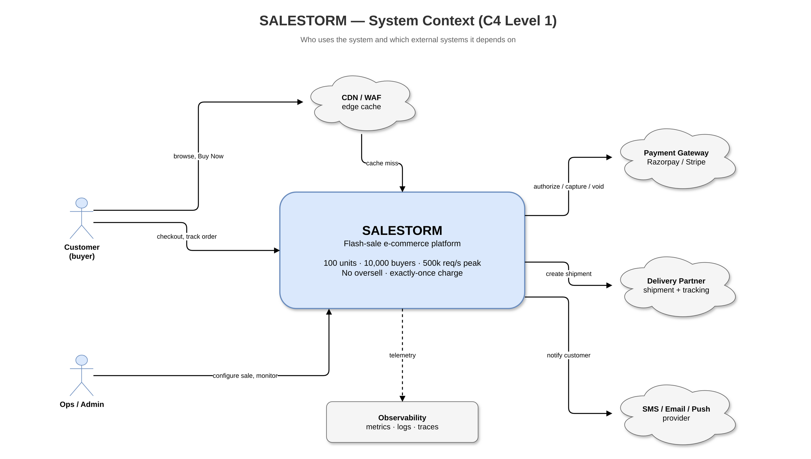
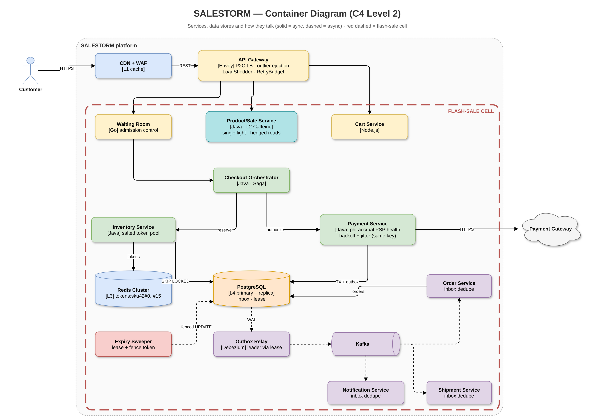
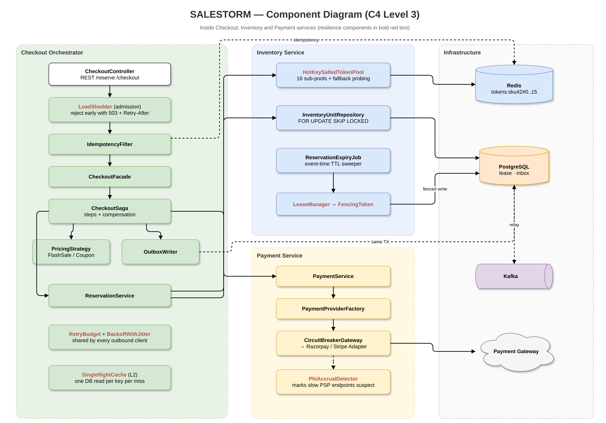
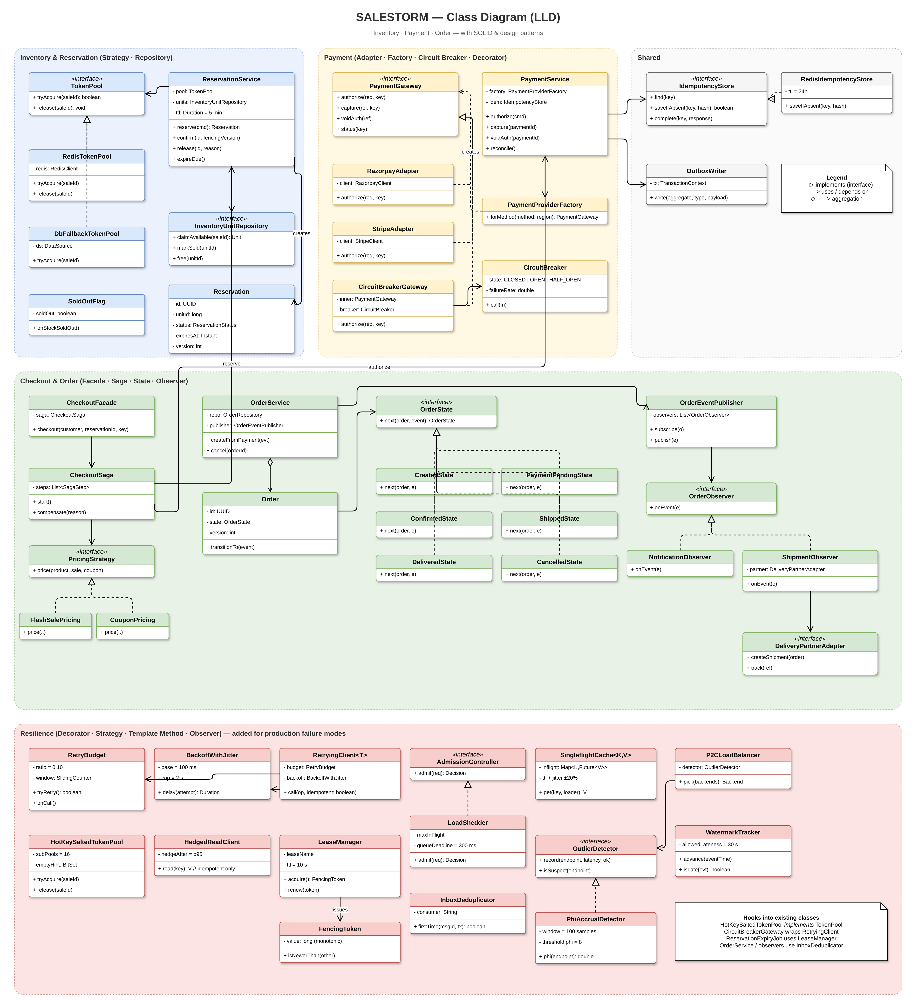
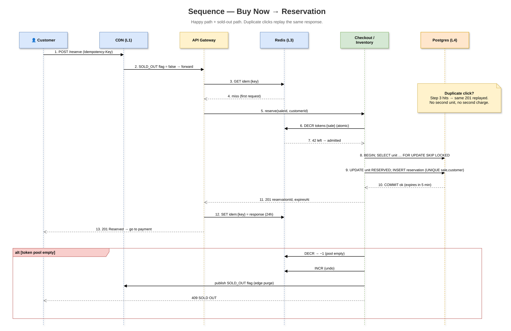
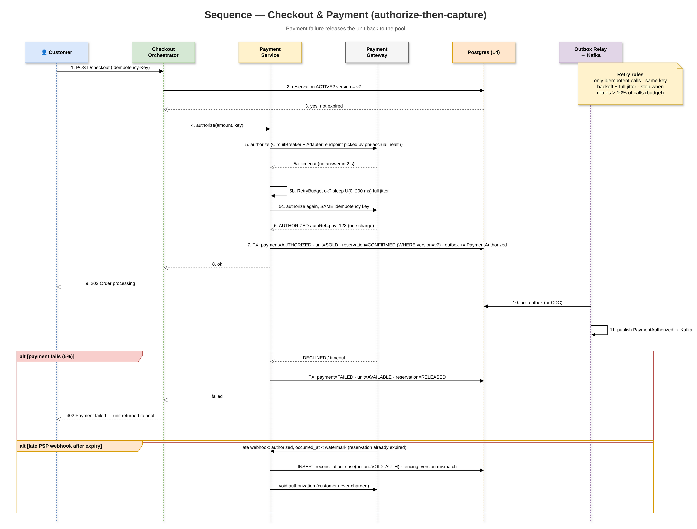
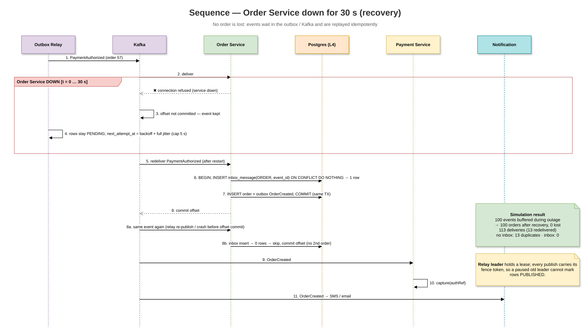
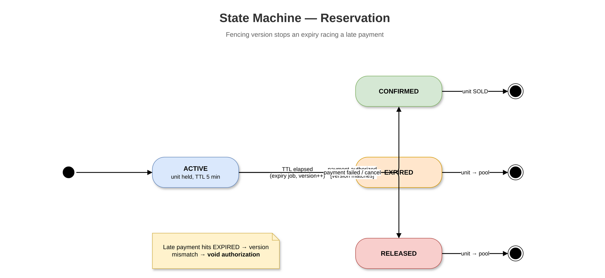
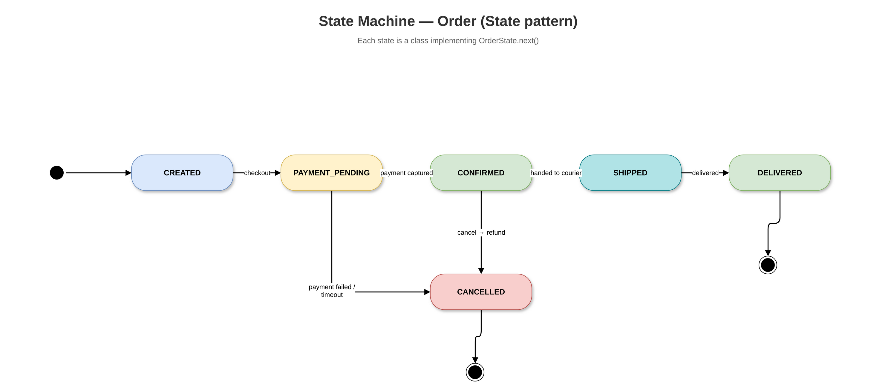

# Diagrams

## How to open in the brief tools

| Tool | Open these files |
|------|------------------|
| **Draw.io / diagrams.net** | Any `*.drawio` under `02_HLD/drawio/`, `03_LLD/drawio/`, `04_Database/drawio/` (or the copies in each `tools/` folder). File → Open Existing Diagram. |
| **dbdiagram.io** | Paste `04_Database/tools/salestorm.dbml` |
| **MySQL Workbench** | File → Run SQL Script → `04_Database/tools/schema_mysql.sql` |
| **PlantUML / StarUML / Visual Paradigm** | Import PNG from `*/drawio/*.png`, or open matching `tools/*.puml` |
| **Swagger** | `05_API/tools/openapi.yaml` in editor.swagger.io |
| **Postman** | Import `05_API/tools/salestorm.postman_collection.json` |

Every diagram was built in **Draw.io (diagrams.net)** and exported to PNG with the Draw.io app. Open any `.drawio` file at [app.diagrams.net](https://app.diagrams.net) to edit it.

PlantUML (`.puml`) and Mermaid (`.mmd`) sources are kept in each `tools/` folder as alternates (they show the original design; the Draw.io files are the current version, including the resilience controls: load shedder, retry budget, singleflight, salted token pool, P2C LB, outlier ejection, flash-sale cell, inbox, lease/fencing).

## High-level design

### System Context

Source: [`02_HLD/drawio/system_context.drawio`](02_HLD/drawio/system_context.drawio)

### Hld Architecture

Source: [`02_HLD/drawio/hld_architecture.drawio`](02_HLD/drawio/hld_architecture.drawio)

### Container

Source: [`02_HLD/drawio/container.drawio`](02_HLD/drawio/container.drawio)

### Component

Source: [`02_HLD/drawio/component.drawio`](02_HLD/drawio/component.drawio)

### Deployment (cell-based)

Source: [`02_HLD/drawio/deployment.drawio`](02_HLD/drawio/deployment.drawio)

### Resilience Controls (failure mode → control on the request path)

Source: [`02_HLD/drawio/resilience_controls.drawio`](02_HLD/drawio/resilience_controls.drawio) · write-up: [`02_HLD/Production_Failure_Modes.md`](02_HLD/Production_Failure_Modes.md)

## Low-level design

### Class Diagram

Source: [`03_LLD/drawio/class_diagram.drawio`](03_LLD/drawio/class_diagram.drawio)

### Concurrency Flow

Source: [`03_LLD/drawio/concurrency_flow.drawio`](03_LLD/drawio/concurrency_flow.drawio)

### Seq Reservation

Source: [`03_LLD/drawio/seq_reservation.drawio`](03_LLD/drawio/seq_reservation.drawio)

### Seq Payment

Source: [`03_LLD/drawio/seq_payment.drawio`](03_LLD/drawio/seq_payment.drawio)

### Seq Order Recovery

Source: [`03_LLD/drawio/seq_order_recovery.drawio`](03_LLD/drawio/seq_order_recovery.drawio)

### State Reservation

Source: [`03_LLD/drawio/state_reservation.drawio`](03_LLD/drawio/state_reservation.drawio)

### State Order

Source: [`03_LLD/drawio/state_order.drawio`](03_LLD/drawio/state_order.drawio)

## Database

### Er Diagram

Source: [`04_Database/drawio/er_diagram.drawio`](04_Database/drawio/er_diagram.drawio)
