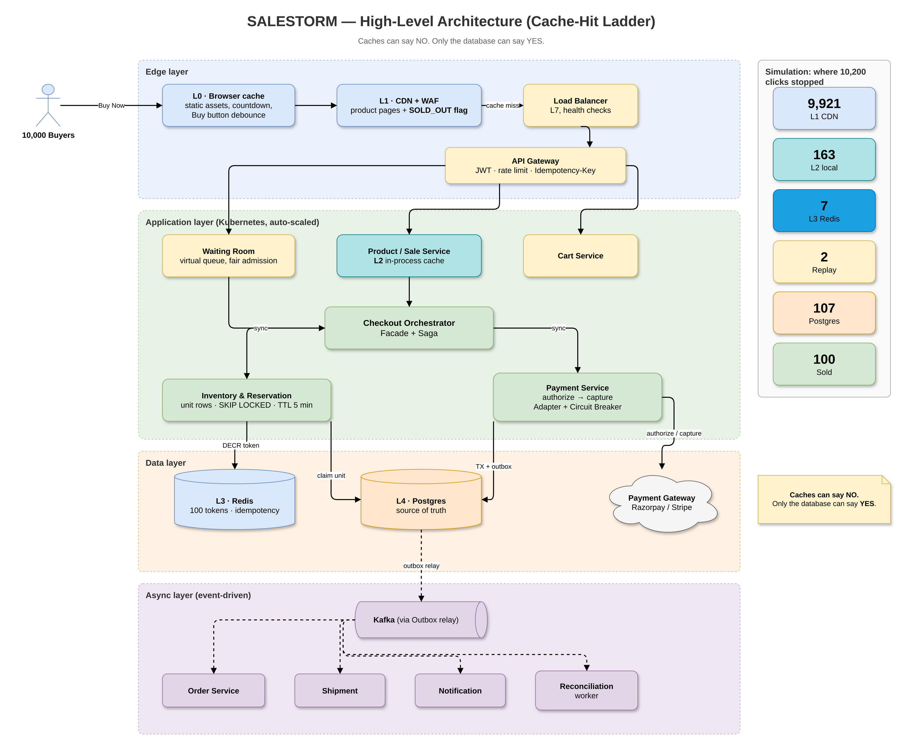

# SALESTORM — Flash-Sale E-Commerce Platform

**SysCrafters 2026 System Design Hackathon**  
Team deliverable for a flash sale with **100 units**, **10,000 concurrent Buy clicks**, and peak traffic up to **500k req/s**.

## Unique factor: the Cache-Hit Ladder

> **Caches can say NO. Only the database can say YES.**

| Tier | Layer | What it does |
|------|--------|--------------|
| L0 | Browser | Debounce Buy, cache static assets |
| L1 | CDN + WAF | Pages + global `SOLD_OUT` flag at the edge |
| L2 | In-process | Product data + sold-out flag per pod |
| L3 | Redis | Pool of **100 admission tokens** + idempotency records |
| L4 | Postgres | Source of truth — the only place a unit is sold |

## Simulation proof (test case)

Ran against: 10,200 requests (200 duplicates), 95% payment success / 5% failure, Order Service outage **30 s**.

| Metric | Safe (our design) | Naive counter |
|--------|-------------------|---------------|
| Units sold | **100** | 650 (oversold by 550) |
| Max charges per customer | **1** | — |
| Orders after outage | **100** | — |
| Invariant checks | **415 / 0 violations** | FAIL |
| Requests that reached DB | **107** of 10,200 | — |

Full run: [`11_AI_Assisted_Validation/simulation/`](11_AI_Assisted_Validation/simulation/).

## Folder map

| Folder | Contents |
|--------|----------|
| [`01_Requirements/`](01_Requirements/) | Requirements & assumptions |
| [`02_HLD/`](02_HLD/) | System context, HLD, container, component, deployment + PlantUML / Draw.io |
| [`03_LLD/`](03_LLD/) | Concurrency, payment/order, class / sequence / state diagrams |
| [`04_Database/`](04_Database/) | ER design, Postgres + MySQL SQL, dbdiagram.io DBML |
| [`05_API/`](05_API/) | OpenAPI (Swagger), Postman collection |
| [`06_SOLID/`](06_SOLID/) | SOLID mapping |
| [`07_Design_Patterns/`](07_Design_Patterns/) | Patterns used |
| [`08_Scalability_Reliability/`](08_Scalability_Reliability/) | Scale & reliability |
| [`09_Security_Observability/`](09_Security_Observability/) | Security & observability |
| [`10_ADR/`](10_ADR/) | Eight Architecture Decision Records |
| [`11_AI_Assisted_Validation/`](11_AI_Assisted_Validation/) | Simulation, Locust, JMeter, AI usage note |
| [`12_Presentation/`](12_Presentation/) | Pitch deck, script, jury Q&A, charts |

## Diagrams as images

All 13 diagrams are built in **Draw.io** and exported as PNG, in `02_HLD/drawio`, `03_LLD/drawio` and `04_Database/drawio`. See them all in **[DIAGRAMS.md](DIAGRAMS.md)**.

## How to open the tool files

See **[13_Tools_Guide.md](13_Tools_Guide.md)** for Draw.io, PlantUML, Mermaid, StarUML, Visual Paradigm, MySQL Workbench, dbdiagram.io, Swagger, Postman, JMeter, Locust, and GitHub.

## Key design decisions (ADRs)

1. Cache-Hit Ladder  
2. Unit rows + `FOR UPDATE SKIP LOCKED`  
3. Redis admission tokens  
4. SQL (Postgres) over NoSQL for inventory  
5. Sync reserve + authorize; async everything else  
6. Authorize-then-capture  
7. Outbox + Kafka + saga  
8. Pessimistic on hot rows, optimistic elsewhere  

## Pitch

Open [`12_Presentation/SALESTORM_Final_Presentation.pptx`](12_Presentation/SALESTORM_Final_Presentation.pptx) and rehearse with [`12_Presentation/pitch_script.md`](12_Presentation/pitch_script.md) (5 minutes).

## License

Hackathon submission — for judging only.
